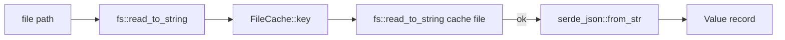

# Caching

dmc has two persistent caches plus several in-process caches. Goal:
warm rebuilds skip every stage that did not change.

## Persistent: file cache

Path: `<output_dir>/.cache/dmc/{16-hex blake3}.json`. One file per
record.

### Key

```
blake3(
  "dmc/v1" |
  CARGO_PKG_VERSION |
  "\0src\0" | source_bytes |
  "\0path\0" | path_string |
  "\0cfg\0" | cfg_fingerprint
)[..16 hex]
```

`cfg_fingerprint` = `blake3(serde_json::to_vec((&compile_cfg,
&include_html, &collection_name, &schema, &output_format)))`. Any
field that affects the rendered record is included.

### Hit path



Skips lex + parse + transform + codegen + sidecar + schema +
mdx-wrap + minify. The cached value is the final velite-shaped
record.

### Miss path


Best effort. A write failure never breaks the build.

## Persistent: math cache

Path: `<output_dir>/.cache/math.json`. One file, JSON array of rows
`[latex, display, engine, html]`.

### Lifecycle

| stage | action |
|-------|--------|
| `Engine::run` start | `Math::load_cache(path)` reads rows into in-memory `HashMap` |
| `Math::render` | `cache.get((latex, display, engine))` -> hit returns instantly |
| `Engine::run` end | `Math::save_cache(path)` flushes the map back |

### Engine variants share file

KaTeX-rendered + MathML-rendered entries co-exist (different
`engine` discriminant). Switching `MathEngine` does not invalidate
either set.

## In-process

| cache | scope | what |
|-------|-------|------|
| `SyntaxBundle` | process | themes + grammars; one parse per process |
| Math `HashMap` | process | latex -> html (also persisted, see above) |
| `Mermaid::cache` | process + disk | rendered SVGs, keyed by `blake3(source)` |
| Pipeline `OnceLock` for KaTeX `Opts` | process | builder allocates JS handles; cache once |
| Sidecar pipeline cache | child process | unified processor per plugin spec |

## Invalidation

| change | what invalidates |
|--------|-------------------|
| edit one file | that file's cache entry only |
| upgrade dmc version | every cache entry (key includes `CARGO_PKG_VERSION`) |
| change config that affects rendering | every entry in that collection (cfg fingerprint changes) |
| change ts plugin code (no config diff) | nothing auto; wipe `.cache/` manually |

## Toggling

| where | how |
|-------|-----|
| TS config | `cacheEnabled: false` in `defineConfig` |
| Rust config | `EngineConfig { cache_enabled: false, ... }` |
| TOML | `cache_enabled = false` |
| nuke | `rm -rf <output_dir>/.cache` |

## Numbers

Demo: `examples/nextjs` kitchen-sink (2 records).

| build | time | speedup |
|-------|------|---------|
| cold | 1187 ms | 1.0x |
| warm | 334 ms | 3.55x |

For larger collections the speedup approaches "skip everything that
did not change". A 1000-file rebuild with 1 changed file costs
roughly the same as compiling 1 file plus 999 cache reads (~50 ms
total).
