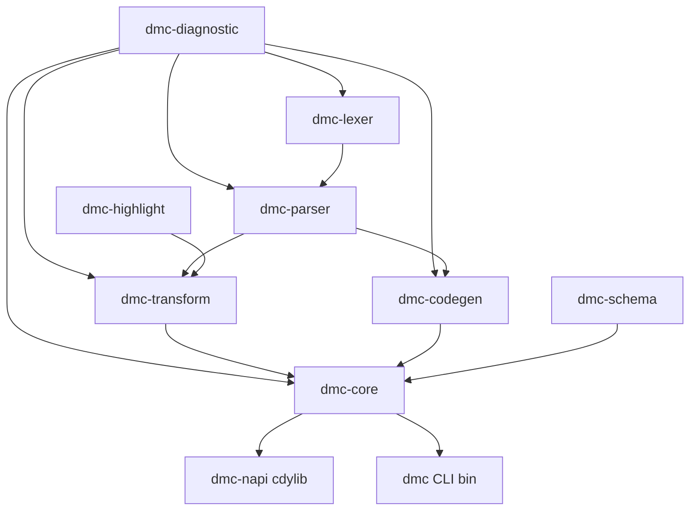
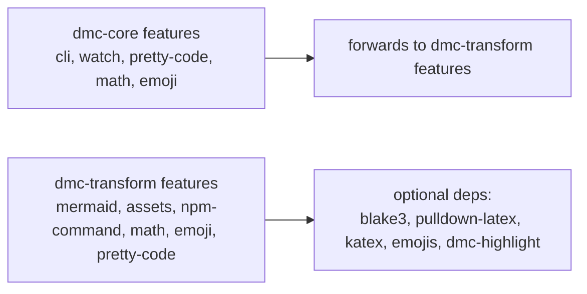

# Crate dependency graph

What depends on what. Why each leaf is a separate crate.

## Graph



`dmc-sidecar` is a pure-JS package; not in the cargo graph but
spawned by `dmc-core::engine::sidecar` at runtime.

## Why each crate exists

| crate | reason for separation |
|-------|----------------------|
| `dmc-diagnostic` | shared `Code` enum used by every layer, gated by features |
| `dmc-lexer` | tokens are stable; isolated for testability |
| `dmc-parser` | grammar surface is large; separation simplifies development |
| `dmc-transform` | plugin-style passes; feature-gated bundles |
| `dmc-codegen` | emit logic; consumed by transformers + core |
| `dmc-highlight` | leaf crate; breaks dmc-codegen <-> dmc-transform cycle |
| `dmc-schema` | leaf crate; Zod descriptor compile |
| `dmc-core` | engine orchestration; pulls everything together |
| `dmc-napi` | cdylib boundary for JS consumers |

## Why no cycles

Cargo forbids package-level cycles. dmc-codegen consumes
dmc-parser; dmc-transform consumes dmc-parser AND dmc-codegen.
Both dmc-codegen and dmc-transform need the syntect highlighter.
If syntect lived in dmc-codegen, dmc-transform would need to depend
on dmc-codegen for the bundle. Fine, BUT dmc-codegen also depends
on dmc-transform (feature-gated) for tests. Cargo says no.

Solution: `dmc-highlight` as a leaf crate. Both dmc-codegen and
dmc-transform depend on it. No cycle.

## Feature graph



dmc-core's features mirror dmc-transform's. Forwarding ensures the
JS plugin gate (in `compile.rs`) and the actual pipeline
registration (in `pipeline.rs`) stay in sync.

## Workspace dependencies

| dep | crate(s) | purpose |
|-----|----------|---------|
| `serde` / `serde_json` | core, parser, transform, schema, napi | AST serialisation, config parsing |
| `serde_yaml` | core | TOML / YAML config loading |
| `rayon` | core | per-file parallelism |
| `globwalk` | core | collection patterns |
| `blake3` | core, transform | cache keys + asset hashing |
| `notify` / `notify-debouncer-mini` | core (watch feature) | watch mode |
| `clap` / `toml` | core (cli feature) | CLI binary |
| `tempfile` | core | TS config host scratch dir |
| `slug` | parser | heading slug generation |
| `syntect` | highlight | grammar + theme runtime |
| `katex` | transform (math) | KaTeX HTML via quick-js |
| `pulldown-latex` | transform (math) | MathML alternative |
| `emojis` | transform (emoji) | unicode lookup |

## Workspace dev-dependencies

| dep | use |
|-----|-----|
| `pretty_assertions` | colour diffs in test failures |
| `tempfile` | per-test scratch dirs |
| `assert_cmd` / `predicates` | CLI integration tests |
| `insta` | snapshot tests |
| `criterion` | bench harness |
| `plotters` | bench plot output |

## Adding a new crate

If a new feature is too large for any existing crate:

1. Create `dmc-X/`.
2. Add to `Cargo.toml` workspace members.
3. Add `dmc-X = { path = "dmc-X" }` to workspace dependencies.
4. Doc under `dmc-docs/dmc-X/`.

Avoid spinning up a new crate when an existing one fits; the build
graph cost is real (cold compile time grows roughly linearly per
crate).

## Slim builds

```bash
cargo build --release \
  -p dmc-core \
  --no-default-features \
  --features cli,watch
```

Drops `dmc-highlight`, `katex`, `pulldown-latex`, `emojis`, `blake3`.
Result: ~8 MB binary that does markdown -> HTML core. Useful when
the consumer ships its own highlighter / math / asset pipeline.

## Reverse impact

| change in | rebuilds |
|-----------|----------|
| `dmc-diagnostic` | every crate |
| `dmc-lexer` | parser, transform, codegen, core, napi |
| `dmc-parser` | transform, codegen, core, napi |
| `dmc-transform` | core, napi |
| `dmc-highlight` | transform, codegen (when consuming HlStyle), core, napi |
| `dmc-codegen` | core, napi |
| `dmc-schema` | core, napi |
| `dmc-core` | napi only |
| `dmc-napi` | leaf; only itself |

Plan refactors so the heavy crates (transform, codegen, core) churn
less.
