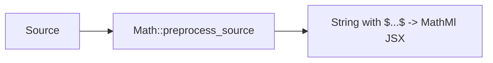
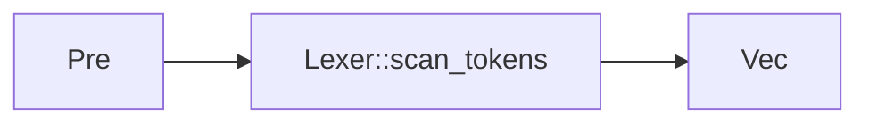
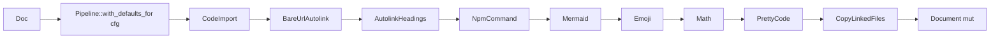
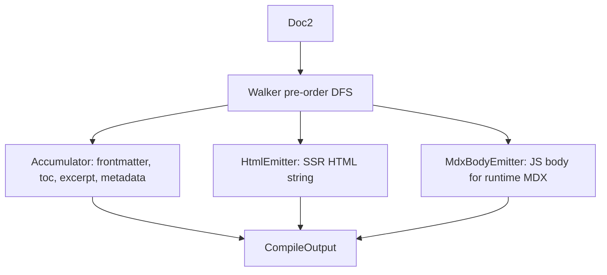
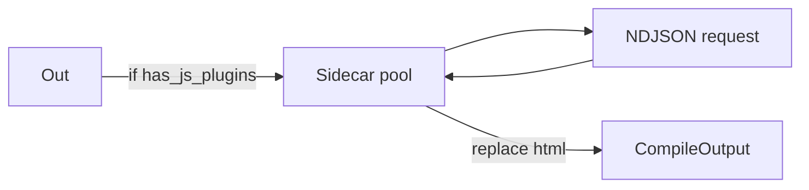
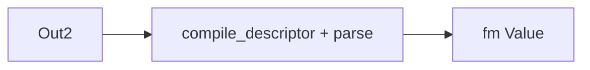
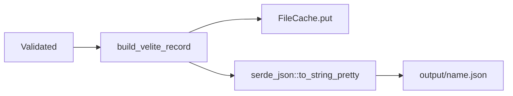
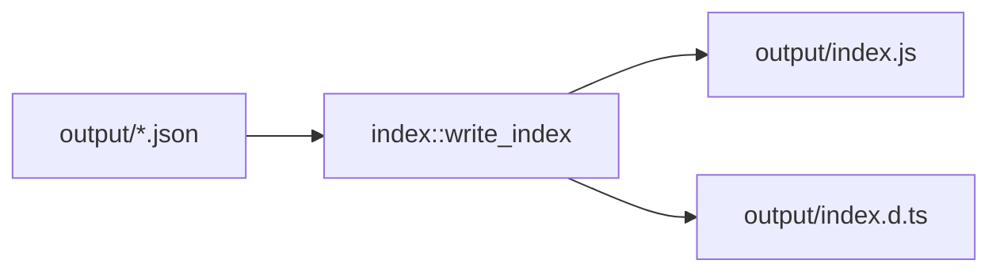

# Data flow

What every byte goes through, from source on disk to JSON record.

## Read

## Preprocess

`$...$` and `$$...$$` are rewritten to `<MathMl mathml="..."/>` JSX
before the lexer so `_`/`^` inside math are not interpreted as
emphasis markers.

## Lex

Tokens carry `kind` + `span` + raw `&str`. Whitespace tokens are
preserved (needed for inline spacing around links).

## Parse

Document is `{ children: Vec<Node>, span }` where `Node` is the AST
enum (Heading, Paragraph, CodeBlock, JsxElement, ...).

## Transform

Order matters: e.g. `BareUrlAutolink` runs before `AutolinkHeadings`;
`Math` runs before `PrettyCode` so math nodes are not seen by the
syntax highlighter. `with_defaults_for` controls the order.

## Walk + emit

One DFS, three sinks. Each sink sees every node. Sinks fire `enter`
slice-order, `leave` LIFO so structural close logic mirrors push.

## Sidecar (optional)

When the user listed unified plugins not owned by native transformers,
the sidecar receives `compiled.content` and returns rendered HTML that
replaces `compiled.html`. The plugin gate strips native-owned names
before dispatch.

## Schema validate

Frontmatter validated against the collection's schema. Failures emit
a diagnostic; record falls back to raw frontmatter.

## Cache + write

## Index

After every collection finishes:

Re-exports each `<name>.json`. Type aliases reference
`typeof import(config)["collections"]` so user types flow through.
