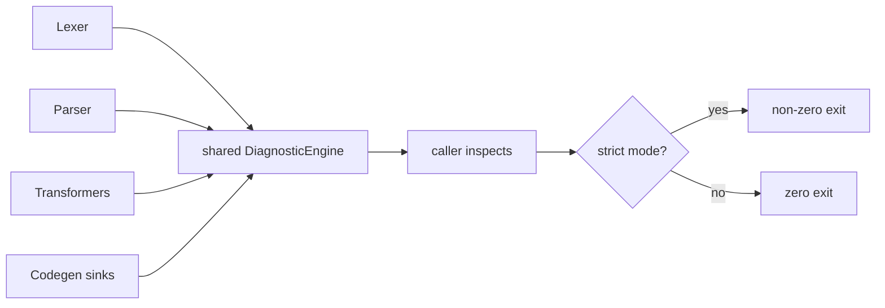

# Error handling

How errors flow through dmc layers. What is fatal vs recoverable.

## Layers

| layer | failure mode |
|-------|-------------|
| lexer | emits diagnostic, continues; never panics |
| parser | emits diagnostic, recovers; never panics |
| transform | emits diagnostic per node; per-block failures isolated |
| codegen | emits diagnostic on bad input, continues |
| schema | error replaces validated value with raw frontmatter |
| sidecar | falls through to native HTML on any failure |
| cache | swallows write errors silently |
| filesystem | propagates to caller via `std::io::Result` |

## Diagnostic flow



## Fatal vs recoverable

### Fatal (engine returns Err)

| failure | cause |
|---------|-------|
| config load failure | `dmc.toml` malformed, `.ts` host missing |
| output dir unwritable | filesystem permissions |
| collection pattern panic | invalid glob (rare; globwalk validates) |

### Recoverable (engine continues, emits diagnostic)

| failure | code |
|---------|------|
| invalid char in source | `E001 InvalidCharacter` |
| unterminated link / image | `P001` / `P002` |
| unterminated JSX | `P005` / `P006` (parser synthesises self-close for recovery: `PW004`) |
| code-import file missing | `T001 ImportFileNotFound` |
| component-preview index missing | `T003` |
| asset copy failed | `T008 AssetCopyFailed` |
| mermaid render failed | `T009 MermaidRenderFailed` |
| schema validation failed | logged via `Code::Custom`; record falls back to raw |
| sidecar failure | `run_sidecar` returns None; native HTML used |
| cache write failure | swallowed; next build retries |

## Severity policy

| severity | meaning | exit code (strict mode) |
|----------|---------|------------------------|
| Error | something is wrong; output is incomplete | non-zero |
| Warning | something looks off; output is best-effort | non-zero (only in strict mode) |

Non-strict mode never fails on warnings. CI typically runs strict.

## Per-block failures

Transformers like `code-import` and `mermaid` emit per-block
diagnostics so one bad fence does not abort the whole build:

```rust
match self.mermaid.render_cached(&cb.value) {
    Ok(svg) => { /* replace with MermaidSvg */ },
    Err(err) => {
        self.pending.push(
            Diagnostic::new(Code::MermaidRenderFailed, format!("mermaid: {}", err))
                .with_label(Label::primary(span, Some("for this mermaid block".into()))),
        );
        NodeAction::Keep   // leave original code block; don't drop
    }
}
```

Pattern: per-block error -> emit diagnostic -> keep original AST node.
User sees the diagnostic + the unprocessed source.

## Sidecar failures

`run_sidecar` returns `Option<String>`:

- `Some(html)` -> sidecar HTML replaces native HTML
- `None` -> any failure (spawn, read, parse JSON, plugin error)

Caller never sees the underlying error type:

```rust
if use_sidecar {
    if let Some(html) = run_sidecar(&compiled.content, cfg) {
        compiled.html = html;
    }
    // else: native HTML kept silently
}
```

For visibility, sidecar plugin errors get logged to stderr (suppressed
by default). Set `dmc_SIDECAR=node-with-stderr-pipe.mjs` or run the
sidecar manually for debugging.

## Cache failures

`FileCache::put`:

```rust
pub fn put(&self, key: &str, value: &Value) {
    let p = self.path_for(key);
    if let Ok(json) = serde_json::to_string(value) {
        let _ = std::fs::write(p, json);
    }
}
```

Errors swallowed entirely. A cache that cannot be written is
equivalent to no cache; the build still succeeds.

## Schema failures

```rust
match schema.parse(fm, &ctx) {
    Ok(v) => v,
    Err(e) => {
        local_diag_engine.emit(diag!(Code::EmptyFrontMatter, format!("schema error: {}", e)));
        compiled.frontmatter.clone()   // fallback
    }
}
```

Validation failure -> diagnostic + raw frontmatter passes through.
Downstream code (consumers of `<name>.json`) see the raw shape; can
still render.

## Custom diagnostic codes

Third-party transformers that need codes outside the upstream `Code`
enum use `Code::Custom`:

```rust
Diagnostic::new(
    Code::Custom { code: "X100".into(), severity: Severity::Warning },
    "my plugin: unrecognised attr",
);
```

Prefer adding a typed variant upstream when contributing back; the
escape hatch exists for genuinely external tools.

## Strict mode

```rust
if cfg.strict && diag_engine.iter().any(|d| /* warning or error */) {
    std::process::exit(3);
}
```

Implemented in the CLI binary, not the engine library. Library
callers inspect `diag_engine` and decide.

## What never panics

- Lexer (emits + continues)
- Parser (recovers + continues)
- Transformer pipeline (per-block isolated)
- HtmlEmitter / MdxBodyEmitter (drops bad nodes with warnings)
- Sidecar caller (None on failure)
- FileCache (silent on write failure)

What can panic:

- Internal `expect` calls (broken invariants; should never trigger;
  treat as bugs).
- `serde_json::from_str` with corrupt cache file (returns Err,
  caller maps to None).

In practice: `cargo test --workspace --features pretty-code` passes
clean and `dmc build` on real content does not panic. If a panic
fires, file a bug.
