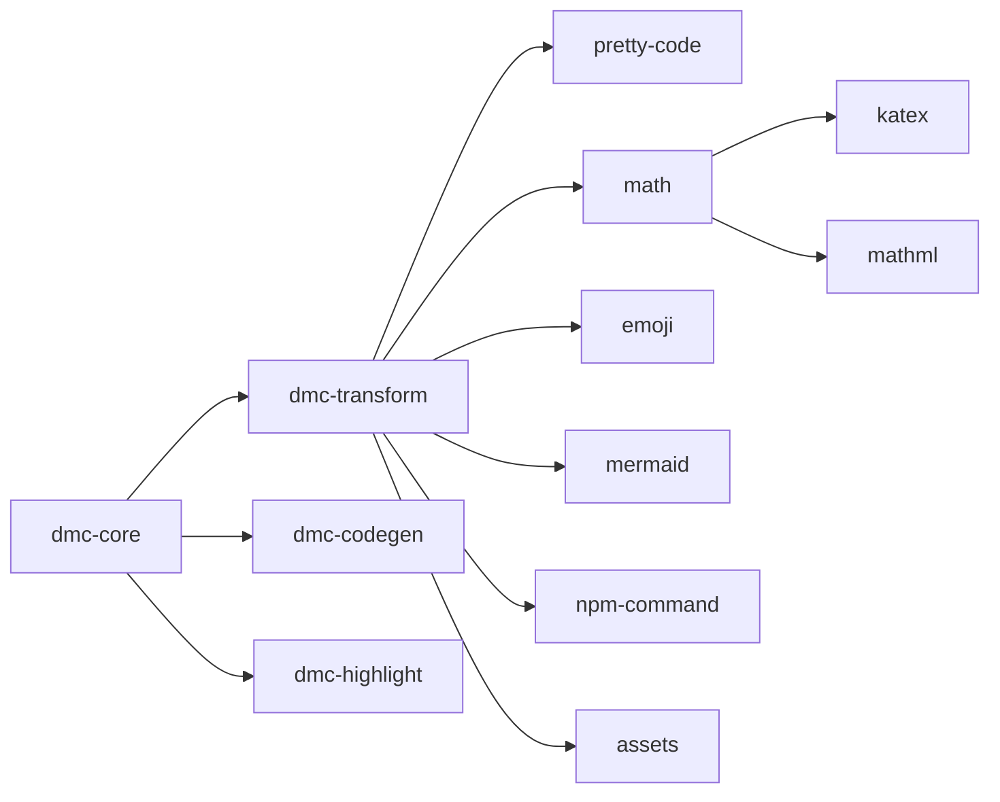

# Feature gates

Cargo features that toggle parts of dmc on or off. Use them to
shrink binary size or skip work for content that doesn't need it.

## Feature graph



## Workspace feature defs

`dmc-core/Cargo.toml`:

```toml
[features]
default = ["pretty-code", "math", "emoji", "mermaid", "npm-command", "assets"]
pretty-code = ["dmc-transform/pretty-code", "dmc-highlight"]
math        = ["dmc-transform/math"]
emoji       = ["dmc-transform/emoji"]
mermaid     = ["dmc-transform/mermaid"]
npm-command = ["dmc-transform/npm-command"]
assets      = ["dmc-transform/assets"]
```

Each feature toggles a specific transformer. Disabling a feature
removes the transformer's compile cost AND its dependency closure
from the binary.

## Per-transformer feature

`dmc-transform/Cargo.toml`:

```toml
[features]
default = ["pretty-code", "math", "emoji", "mermaid", "npm-command", "assets"]
pretty-code = ["dep:syntect", "dep:dmc-highlight"]
math        = ["dep:quick-js", "dep:pulldown-latex"]
emoji       = ["dep:emojis"]
mermaid     = ["dep:tokio", "dep:reqwest"]
npm-command = []
assets      = []
```

`dep:` syntax (Cargo 1.60+) means the dep is only added when the
feature is on; otherwise it is not in `Cargo.lock`.

## Pipeline gate consultation

`Pipeline::with_defaults_for(cfg)` reads features at compile time:

```rust
pub fn with_defaults_for(cfg: &PipelineConfig) -> Self {
    let mut p = Pipeline::new();

    p.add(CodeImport::new());
    p.add(BareUrlAutolink);
    p.add(AutolinkHeadings::new());

    if !cfg.markdown_gfm { p.add(DisableGfm); }

    #[cfg(feature = "npm-command")]
    p.add(NpmCommand::new());

    #[cfg(feature = "mermaid")]
    p.add(Mermaid::new());

    #[cfg(feature = "emoji")]
    p.add(Emoji::new());

    #[cfg(feature = "math")]
    if let Some(engine) = cfg.math_engine.clone() {
        p.add(Math::new(engine));
    }

    #[cfg(feature = "pretty-code")]
    if let Some(theme) = cfg.pretty_code.clone() {
        p.add(PrettyCode::new(theme));
    }

    if cfg.copy_linked_files {
        p.add(CopyLinkedFiles);
    }
    p
}
```

Code under `#[cfg(...)]` is compiled out when the feature is off.
The pipeline is shorter, the binary smaller.

## Feature minimums

| use case | features needed |
|----------|----------------|
| plain markdown -> HTML | none (default off) |
| GFM tables / strike / task list | always on (built-in) |
| math (block + inline) | `math` |
| math + cache | `math` (cache is automatic) |
| emoji shortcodes | `emoji` |
| code highlighting | `pretty-code` |
| mermaid SVG | `mermaid` |
| npm install / pnpm i / yarn add helper | `npm-command` |
| copy `[!image](./logo.png)` to output | `assets` |

## Disabling everything

```bash
cargo build --release -p dmc-core --no-default-features
```

You get: lex + parse + GFM transformers + HTML emit. No syntax
highlighting, no math, no mermaid. Binary is roughly 4 MB instead
of 12 MB. Useful for CI tools that only need structural output.

## Subset builds

```bash
# math + highlighting only
cargo build --release -p dmc-core --no-default-features --features pretty-code,math
```

## Run-time vs compile-time

dmc draws the line at compile time:

- **Compile-time off**: feature flag absent. Code does not exist
  in binary.
- **Compile-time on, run-time off**: feature flag present but
  `cfg.math_engine = None`. Transformer struct exists but pipeline
  doesn't include it.

Run-time toggle gives flexibility (one binary, many configs).
Compile-time toggle gives smaller binaries.

## When to use which

- Library / framework: ship default features. Users disable what
  they don't need.
- Standalone CLI: features as the user requests at install time.
- Embedded tool: minimal features. Compile out the parts you don't
  use.

## Plugin gate interplay

When a feature is *on* but the user provides equivalent JS plugins
in `compileOptions.remarkPlugins`, the engine's plugin gate strips
the JS plugin from the sidecar payload (it has nothing to do; the
native transformer already ran). See
[`dmc-core/internals.md`](../dmc-core/internals.md#plugin-gate).

When a feature is *off* and the user provides the JS plugin, the
sidecar runs it normally. dmc gracefully falls back to JS for any
feature it doesn't have natively.

## Testing feature combinations

CI runs:

```bash
cargo check --workspace --all-features
cargo check --workspace --no-default-features
cargo test  --workspace --features pretty-code   # current default
```

Each combination must build clean. Cross-feature interactions are
caught here.
