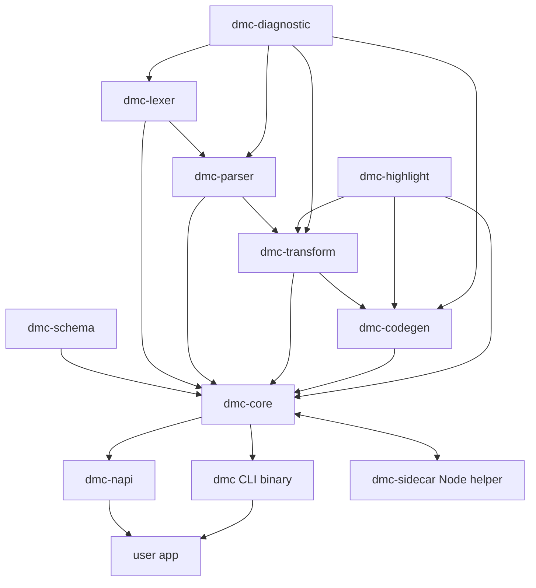
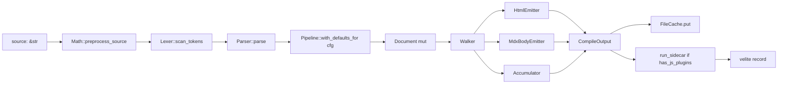
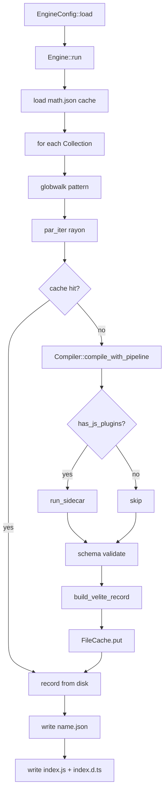

# Architecture overview

dmc compiles MDX to JSON records. Every stage is a separate crate so
each layer can evolve independently and consumers (CLI, napi, tests)
can opt into only what they need.

## Crate graph

| crate | layer | reason it is its own crate |
|-------|-------|---------------------------|
| `dmc-diagnostic` | shared | all layers emit through one `Code` enum |
| `dmc-lexer` | tokenise | tokens are stable; multiple parsers could share |
| `dmc-parser` | AST build | grammar surface big enough to warrant isolation |
| `dmc-transform` | AST passes | plugin-style passes; feature-gated |
| `dmc-codegen` | emit | sinks for HTML / MDX body |
| `dmc-highlight` | leaf | breaks codegen <-> transform cycle |
| `dmc-schema` | leaf | Zod-style descriptor compile |
| `dmc-core` | engine | orchestrate + cache + sidecar |
| `dmc-napi` | binding | napi-rs cdylib |
| `dmc-sidecar` | helper | Node JS plugin runner |

## Per-file pipeline

## Build pipeline

## Data flow

| stage | input | output |
|-------|-------|--------|
| lexer | UTF-8 source | `Vec<Token>` |
| parser | tokens | `Document` (AST root) |
| transform | mutable `Document` | mutated `Document` |
| codegen | `Document` | HTML string + MDX body string + accumulator data |
| schema | parsed frontmatter `Value` | validated `Value` |
| collection | per-file outputs | `<name>.json` |
| index | every collection name | `index.js` + `index.d.ts` |

## Why this layering

- **Parse once, emit many**: one AST feeds Accumulator + HtmlEmitter
  + MdxBodyEmitter through `Walker`. No redundant traversals.
- **Native first, sidecar second**: native transformers absorb every
  popular JS plugin. Sidecar handles the remainder. Gate strips
  duplicate names from the JS payload.
- **Persistent cache**: file output keyed by `(version, source, path,
  cfg)` survives across builds. Math render cache survives too.
- **Feature flags**: every transformer is gated. Slim builds drop
  bundles via `--no-default-features`.
