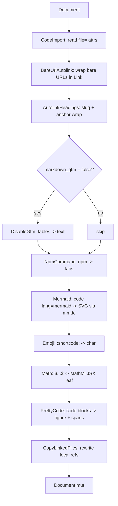

# Pipeline

`Pipeline::with_defaults_for(cfg)` is the single uniform place where
every feature-gated transformer registers. No `cfg!(feature = ...)`
checks in consumer crates.

## Default chain

```rust
let mut p = Pipeline::new()
    .add(CodeImport::new())
    .add(BareUrlAutolink)
    .add(AutolinkHeadings::new());

if cfg.markdown_gfm == Some(false) {
    p = p.add(DisableGfm);
}

#[cfg(feature = "npm-command")]
{ p = p.add(NpmCommand); }

#[cfg(feature = "mermaid")]
{ p = p.add(Mermaid::default()); }

#[cfg(feature = "emoji")]
{ p = p.add(Emoji); }

#[cfg(feature = "math")]
{
    if let Some(engine) = cfg.math_engine {
        Math::set_engine(engine);
    }
    p = p.add(Math);
}

#[cfg(feature = "pretty-code")]
{
    let pc = cfg.pretty_code.as_ref()
        .map(PrettyCode::from_options)
        .unwrap_or_default();
    p = p.add(pc);
}

#[cfg(feature = "assets")]
if let Some(opts) = &cfg.copy_linked_files {
    p = p.add(CopyLinkedFiles::new(/* ... */));
}
```

## Order



## Why this order

- `BareUrlAutolink` before `AutolinkHeadings`: bare URLs in headings
  should still be wrapped as links inside the heading anchor wrap.
- `AutolinkHeadings` before `DisableGfm`: heading anchors are valid
  even when GFM tables are off.
- `Mermaid` before `Emoji` / `Math` / `PrettyCode`: mermaid blocks
  hand off to `mmdc`; later transformers should not see them.
- `Math` before `PrettyCode`: math nodes become opaque JSX before the
  highlighter sees them; otherwise math could be syntax-highlighted
  as some random language.
- `PrettyCode` last among display passes so its `<figure>` shape is
  the final layer.

## Pipeline trait

```rust
pub trait Transformer {
    fn name(&self) -> &str { "anonymous" }
    fn transform(
        &self,
        doc: &mut Document,
        meta: &SourceMeta,
        diag_engine: &mut DiagnosticEngine<Code>,
    );
}
```

Path: `dmc_transform::Transformer`. Every built-in implements this.

## Config

```rust
pub struct PipelineConfig {
    pub markdown_gfm: Option<bool>,
    pub pretty_code: Option<PrettyCodeOptions>,
    pub math_engine: Option<MathEngine>,
    pub copy_linked_files: Option<CopyLinkedFilesOptions>,
}
```

Path: `dmc_transform::PipelineConfig`. Built from `CompileConfig` via
`compile_cfg.pipeline_config(path)` in `dmc-core`.

## Custom transformers

```rust
let pipeline = Pipeline::with_defaults_for(&pipeline_cfg)
    .add(MyCustomPass);
pipeline.run(&mut doc, &meta, &mut diag);
```

Append to the default chain via `.add(...)`. Or build from scratch via
`Pipeline::new()` for tests.
