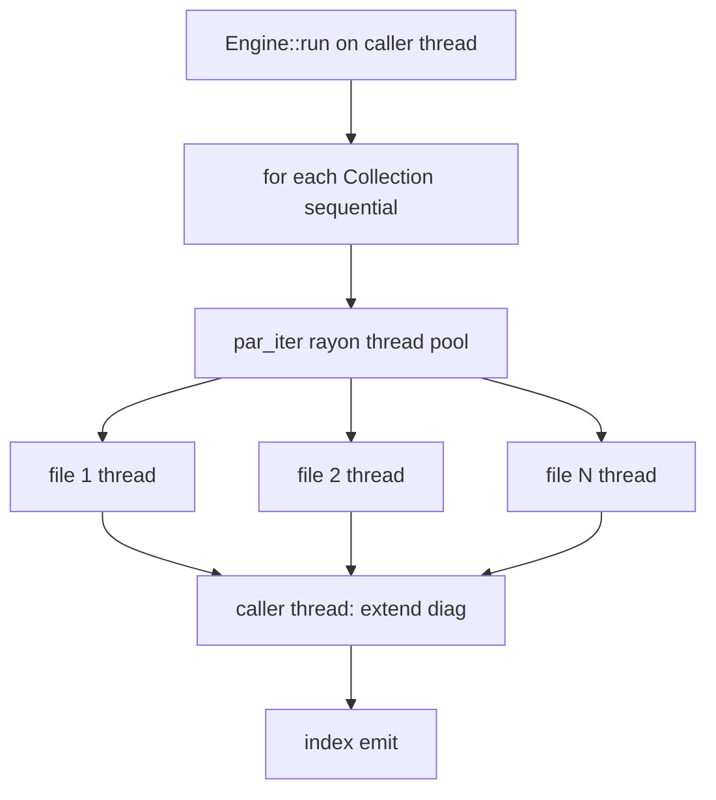

# Threading model

Where dmc uses threads, what is shared, what is private.

## Per-build call



| stage | thread |
|-------|--------|
| `Engine::run` | caller |
| collection loop | caller (sequential) |
| per-file inside collection | rayon worker pool |
| diag merge | caller after each collection |
| index emit | caller |

## Rayon pool

Default = `RAYON_NUM_THREADS` or `std::thread::available_parallelism()`.
Override:

```bash
RAYON_NUM_THREADS=4 dmc build
```

Each rayon worker gets:

- private `DiagnosticEngine<Code>`
- shared `&EngineConfig`
- shared `&FileCache` (read-only methods; internal `fs::write` is
  per-key so no contention)

## Shared state

| state | shared by | sync |
|-------|-----------|------|
| `SyntaxBundle` | every parse + render across threads | `OnceLock`, immutable after init |
| `Math::cache` | every math render | `Mutex<HashMap>` |
| `KaTeX Opts` | every math render | `OnceLock` |
| `Mermaid::cache` | every mermaid render | `Mutex<HashMap>` |
| `Sidecar pool` | every file that needs sidecar | `Vec<Mutex<Option<Sidecar>>>` |
| `FileCache` | every file (read + write) | per-file path; no cross-file sync needed |

## Private state

| state | per-call lifetime |
|-------|------------------|
| `DiagnosticEngine` | per worker thread per file |
| `Lexer` | per file (consumes source string) |
| `Parser` | per file (consumes token vec) |
| `Pipeline` | shared; transformers are `Send + Sync` |
| `HtmlEmitter` / `MdxBodyEmitter` / `Accumulator` | per file |
| `Walker` | per file |

## Sidecar pool acquisition

```rust
for _ in 0..n {
    let idx = NEXT_SLOT.fetch_add(1, Ordering::Relaxed) % n;
    if let Ok(g) = pool[idx].try_lock() {
        guard = Some(g);
        break;
    }
}
```

Round-robin try_lock fast-path; falls back to blocking lock on a
random pick if every slot is busy. Avoids head-of-line blocking
when one slot is slow on a request.

## Math cache contention

`Mutex<HashMap<(latex, display, engine), html>>` is a global lock.
Per-render acquire-release cost is sub-microsecond on uncontended
locks. With ~1000 math expressions / second across cores, the lock
is well below saturation. Profile if your fixture exceeds this.

## SyntaxBundle threading

Constructed once via `OnceLock`. Read-only after init.

```rust
pub fn get() -> &'static SyntaxBundle {
    static B: OnceLock<SyntaxBundle> = OnceLock::new();
    B.get_or_init(|| { /* ... */ })
}
```

`OnceLock::get_or_init` ensures only one init even under concurrent
first-call. Subsequent calls return the cached `&'static`.

## Transformer trait bounds

```rust
pub trait Transformer {
    fn transform(&self, doc: &mut Document, meta: &SourceMeta, engine: &mut DiagnosticEngine<Code>);
}
```

`&self` (not `&mut self`) so a single `Pipeline` is shared across
threads. Mutable per-call state lives in the visitor passed to
`walk_root`.

For mutable shared state on a transformer: use `Mutex<...>`. The
`Mermaid` transformer caches SVGs this way.

## Why no async

| consideration | choice |
|---------------|--------|
| filesystem read | rayon parallel sync; faster than tokio for lots of small files |
| filesystem write | same |
| sidecar IPC | sync stdio; per-file blocks one rayon worker |
| math render | sync (quick-js is sync) |
| syntax highlight | sync CPU work |

Sync code with rayon `par_iter` is the simplest model that scales
linearly with cores. No tokio overhead. The only async surface is
the napi `build()` wrapper, which awaits user-supplied
`prepare`/`complete` hooks.

## Watch mode threading

Single watcher thread (notify) feeds events to a debouncer. On
debounce fire, the main thread runs `Engine::run` again. Rayon
spins fresh workers per call.

## Long-running pool warmth

Watch mode stays in-process across rebuilds. The rayon thread pool
lives once per process (lazy global). Workers stay warm; subsequent
rebuilds skip thread spawn cost.

Same for `SyntaxBundle`, `Math::cache` (in-memory), and
`Mermaid::cache`.

## Concurrent build calls

`Engine::run` is callable concurrently from multiple threads (e.g.
several configs in parallel). The shared statics are `Send + Sync`
so no aliasing UB. Practical use is rare; usually one build per
process.

## Limits

- rayon thread pool defaults to core count; on big-core hosts (32+)
  you may want `RAYON_NUM_THREADS=8` to avoid hyperthread contention.
- sidecar pool is `min(cores, 4)`; bump via `DMC_SIDECAR_POOL_SIZE`
  if foreign plugins are heavy and you have spare cores.
- Mutex contention only matters at scale; dmc's hot paths are
  contention-free until you exceed ~10k math/sec.
