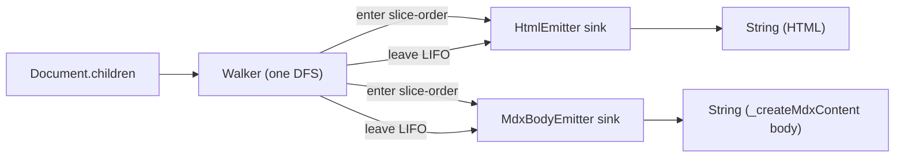

# dmc-codegen

AST to output. Two emitters live here:

- `HtmlEmitter` - static HTML for SSR / SSG.
- `MdxBodyEmitter` - JS body for the MDX runtime (React `jsx` / `jsxs` / `Fragment` calls).

Both implement `NodeSink`. A single `Walker` does one pre-order DFS over `doc.children` and fans every node to every active sink. No extra tree traversals.

## Crate layout

```text
dmc-codegen/
|- src/
|  |- lib.rs       NodeSink + WalkCtx + Walker
|  |- html.rs      HtmlEmitter, render_html
|  |- mdx.rs       MdxBodyEmitter, render_mdx_body
|  `- escape.rs    escape_text, escape_attr
|- codegen-samples/
|  `- codegen.rs   binary: render an .mdx file via lex+parse+transform+codegen
`- tests/
   |- html.rs
   `- mdx_body.rs
```

## Walker to sinks



Sinks are independent. You can run just `HtmlEmitter`, just `MdxBodyEmitter`, or both attached to one walk.

## Quick use

```rust
use dmc_codegen::{HtmlEmitter, MdxBodyEmitter, Walker};
use dmc_parser::parse;

let doc = parse("# hi\n\npara");

// one renderer:
let html = dmc_codegen::render_html(&doc);

// or, both off the same walk:
let mut h = HtmlEmitter::new();
let mut m = MdxBodyEmitter::new();
Walker::new(&doc).walk(&mut [&mut h, &mut m]);
let (html, h_diag) = h.into_parts();
let (body, m_diag) = m.into_parts();
```

## Diagnostics

Each emitter owns a `DiagnosticEngine<dmc_diagnostic::Code>` during the walk. Call `into_parts()` after the walk to pull out `(output, diag_engine)`; merge into the caller's engine via `outer.extend(diag)`. The convenience entry points (`render_html`, `render_mdx_body`) discard the diagnostic engine.

## See also

- [`api.md`](./api.md) - every public type / function / method.
- [`walker.md`](./walker.md) - pre-order DFS, `enter` slice order vs `leave` LIFO, `WalkCtx`.
