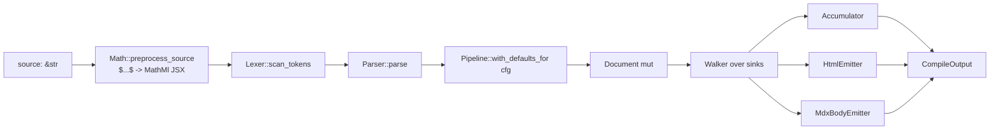

# Compiler

`Compiler::compile_with_pipeline` is the per-file entry. One source
string in, one `CompileOutput` out.

## Stages



## Source preprocess

```rust
#[cfg(feature = "math")]
let preprocessed = dmc_transform::Math::preprocess_source(source);
#[cfg(feature = "math")]
let source: &str = &preprocessed;
```

Rewrites `$...$` and `$$...$$` to `<MathMl mathml="..."/>` JSX before
the lexer runs. Avoids the parser interpreting `_`/`^` inside math as
emphasis markers.

## Lex + parse

```rust
let mut lexer = Lexer::new(source, meta.clone(), diag_engine);
let _ = lexer.scan_tokens();

let mut doc = {
    let mut parser = Parser::new(lexer.tokens, meta.clone(), diag_engine);
    parser.parse()
};
```

One `DiagnosticEngine` shared across both layers; codes are namespaced
by prefix (`E*` lexer, `P*` parser).

## Pipeline

```rust
let pipeline_cfg = compile_cfg.pipeline_config(path);
let pipeline = dmc_transform::Pipeline::with_defaults_for(&pipeline_cfg);
pipeline.run(&mut doc, &meta, diag_engine);
```

`with_defaults_for(cfg)` is the single uniform place where every
feature-gated transformer registers (DisableGfm, NpmCommand, Mermaid,
Emoji, Math, PrettyCode, CopyLinkedFiles). See
`dmc-docs/dmc-transform/pipeline.md`.

## Walker + sinks

`Walker::new(&doc).walk(sinks)` does one pre-order DFS over
`doc.children`. Each sink (Accumulator, HtmlEmitter, MdxBodyEmitter)
sees every node. See `dmc-docs/dmc-codegen/walker.md`.

```rust
let mut acc = Accumulator::new();
let mut html_sink = if cfg.emit_html { Some(HtmlEmitter::new()) } else { None };
let mut body_sink = if cfg.emit_body { Some(MdxBodyEmitter::new()) } else { None };

let mut sinks: Vec<&mut dyn dmc_codegen::NodeSink> = Vec::with_capacity(3);
sinks.push(&mut acc);
if let Some(ref mut h) = html_sink { sinks.push(h); }
if let Some(ref mut b) = body_sink { sinks.push(b); }

Walker::new(&doc).walk(sinks.as_mut_slice());
```

`emit_html` / `emit_body` toggle whether the sink runs. When the JS
sidecar will produce HTML downstream, `for_render` flips `emit_html`
off so we do not double-render.

## `CompileOutput`

| field | source |
|-------|--------|
| `frontmatter` | parsed YAML as `Value` (via `Accumulator`) |
| `frontmatter_raw` | original YAML string |
| `content` | normalised markdown (post-preprocess) |
| `html` | `HtmlEmitter` output |
| `body` | `MdxBodyEmitter` output (JS function body) |
| `excerpt` | first paragraph plain text |
| `metadata` | reading time + word count from plain text |
| `toc` | nested heading list from `Accumulator` |
| `imports` / `exports` | top-level `import`/`export` statements |

## `for_render`

```rust
pub fn for_render(&self) -> Self {
    let mut c = self.clone();
    c.emit_html = !self.has_js_plugins();
    c
}
```

Per-file config used by `Collection::process`. Skips native HTML when
the sidecar will render it, avoiding double work.
