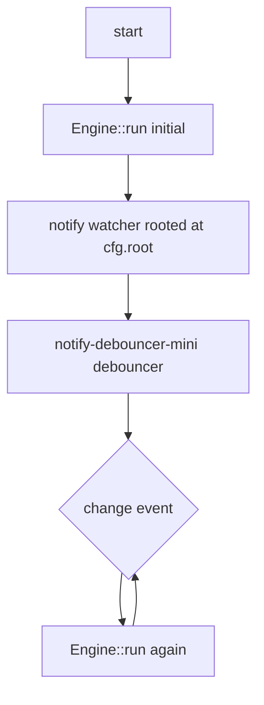

# Watch mode (`dmc dev`)

Long-running build that re-runs on file change.

## Run

```bash
dmc dev
```

Or via napi:

```ts
import { build } from "@gentleduck/md";
import config from "./duck-md.config";

await build(config);   // initial pass
// then run a watcher; on change, re-call build()
```

The dmc CLI binary wraps the watcher loop; consumers using napi
typically rely on Next.js / Vite's own file watcher and call `build`
on each cycle.

## Internals



| crate | use |
|-------|-----|
| `notify` | OS-level file watcher (inotify / FSEvents / ReadDirectoryChangesW) |
| `notify-debouncer-mini` | coalesce rapid edits |

Default debounce: 100 ms. Override via `DMC_WATCH_DEBOUNCE_MS` env.

## What gets watched

Every file under `cfg.root` matching any collection `pattern`. New
files (added between builds) are picked up because the watcher is
rooted at the dir, not at individual paths.

The config file itself is also watched (when the CLI knows its
path); changes to `duck-md.config.ts` trigger a full rebuild.

## Cache interaction

The persistent cache (file + math) lives in
`<output_dir>/.cache/`. Watch-mode rebuilds:

1. File-level cache hit when source unchanged.
2. New compile when source bytes changed.
3. Math cache always warm across rebuilds.
4. Index regenerated on every build (tiny cost).

So a 1000-file repo where one file changed costs ~50 ms in watch
mode (one compile + 999 cache reads + index emit).

## Errors

Per-file errors emit diagnostics to the engine. The CLI prints them
between rebuilds. Watch mode keeps running on errors; never exits
non-zero.

To force a full clean rebuild:

```bash
rm -rf .gentleduck/.cache
dmc dev
```

## Memory

Long-running processes accumulate the in-process caches:

- `SyntaxBundle` (one-time)
- KaTeX `Opts` (one-time)
- Math render `HashMap` (grows with unique math expressions)
- Mermaid SVG `HashMap` (grows with unique mermaid sources)

Math + Mermaid caches are bounded by unique-content count, not by
build count. A typical docs repo levels off well under 100 MB.

## Foreign plugin watching

The dmc-sidecar Node child is reused across rebuilds. Plugin
processor cache (in the child) persists; second-pass plugin import
is free.

If foreign plugin code changes, the child does NOT auto-reload.
Restart `dmc dev` to pick up plugin source edits.

## CI use

Avoid `dmc dev` in CI; it never exits. Use `dmc build` for
one-shot. Persist `.gentleduck/.cache/` between CI runs (e.g. via
GitHub Actions cache action) so rebuilds stay warm.

## Feature flag

The `watch` Cargo feature (default on) gates the watcher dependency.
Drop via `--no-default-features` for a build-only binary.
