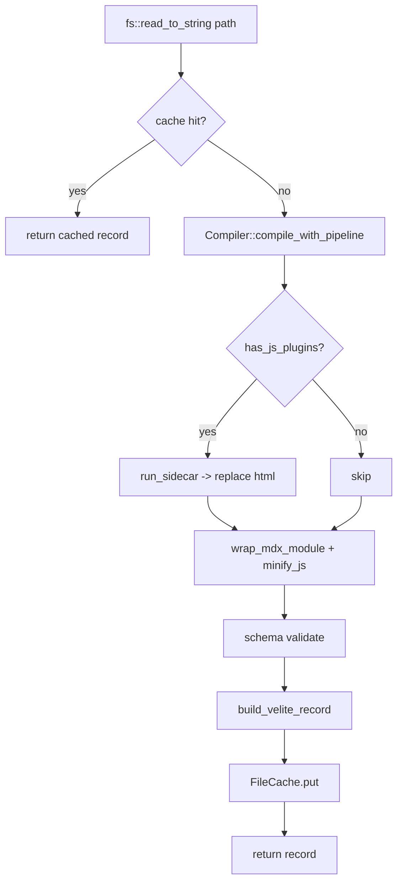

# dmc-core internals

Engine orchestration. How the moving pieces lock together.

## Layout

```
dmc-core/src/
|- lib.rs                  pub re-exports
|- main.rs                 CLI binary entry (cli feature)
|- cli/                    clap subcommands (build, dev, init)
|- engine/
|   |- mod.rs              Engine struct + run()
|   |- compile.rs          Compiler + CompileConfig + plugin gate
|   |- collection.rs       Collection::process per-file pipeline
|   |- config.rs           EngineConfig + load_ts
|   |- cache.rs            FileCache + fingerprint
|   |- sidecar.rs          Sidecar pool + run_sidecar
|   |- accumlator.rs       sink that pulls metadata
|   |- index.rs            write_index(out_dir, ...)
|   |- schema_ts.rs        TS schema descriptor compile
|   `- utils.rs            wrap_mdx_module, minify_js, build_velite_record
`- loaders.rs              custom loader plumbing
```

## Engine state

```rust
pub struct Engine;
```

Stateless. All state lives in `EngineConfig` + per-call locals.
`run()` is the only entry.

## Per-file path

`Collection::process` runs files in parallel via rayon. For each:



## Diagnostics flow

Each `par_iter` thread gets a private `DiagnosticEngine<Code>`. After
the parallel collect, all per-thread engines merge into the caller's:

```rust
let outcomes: Vec<(Option<Value>, DiagnosticEngine<Code>)> = paths.par_iter().map(|path| {
    let mut local = DiagnosticEngine::<Code>::new();
    // ...
    (Some(rec), local)
}).collect();

let mut records: Vec<Value> = Vec::with_capacity(outcomes.len());
for (rec, local) in outcomes {
    diag_engine.extend(local);
    if let Some(r) = rec { records.push(r); }
}
```

Avoids `Mutex<DiagnosticEngine>` contention at every emit.

## Cache fingerprint

```rust
let cfg_fp = fingerprint(&(
    &cfg.compile,
    &cfg.include_html,
    &self.name,
    &self.schema,
    &cfg.output_format,
));
```

Tuple of every field that influences rendered output. Adding a new
`CompileConfig` field that affects emission must be added here too;
otherwise stale-cache bugs.

`fingerprint` = `blake3(serde_json::to_vec(...))`. The 32-byte hash
goes into the file cache key.

## Sidecar pool

```rust
static POOL: OnceLock<Vec<Mutex<Option<Sidecar>>>> = OnceLock::new();
```

One slot per pool worker. Each slot holds an `Option<Sidecar>`;
spawned lazily on first use. Round-robin acquisition with try_lock
fast-path; falls back to blocking on a round-robin pick if every
slot is busy.

Pool size = `min(cores, 4)` by default; override via
`DMC_SIDECAR_POOL_SIZE` env.

## Watch mode

```rust
fn dev(cfg: &EngineConfig, config_path: &Path) {
    let (tx, rx) = mpsc::channel();
    let mut debouncer = new_debouncer(Duration::from_millis(100), tx).unwrap();
    debouncer.watcher().watch(&cfg.root, RecursiveMode::Recursive).unwrap();

    Engine::run(cfg, Some(config_path), &mut diag).unwrap();

    for events in rx {
        // ... debounced events arrive here
        Engine::run(cfg, Some(config_path), &mut diag).unwrap();
    }
}
```

Persistent cache makes each rebuild fast. dmc's process stays warm
(SyntaxBundle, KaTeX engine, math cache).

## TS config host

`EngineConfig::load_ts` spawns a JS process to import the user's
config:

```rust
let attempts = &[("bun", &[]), ("node", &["--import", "tsx"])];
for (cmd, args) in attempts {
    let mut c = Command::new(cmd);
    c.args(*args).arg(&tmp_script).arg(&abs_config);
    match c.output() {
        Ok(out) if out.status.success() => return parse_json(out.stdout),
        // ... else try next
    }
}
```

Output is JSON (the resolved EngineConfig). The temp script
`load-config.mjs` imports the user's config + serialises to JSON.

## Index emit

After all collections process:

```rust
let format = cfg.output_format.as_deref().unwrap_or("esm");
index::write_index(&cfg.output_dir, &cfg.collections, format, config_path)?;
```

Writes `index.js` + `index.d.ts`. ESM by default; CJS via
`output.format`. `config_path` (the user's `.ts` file) is referenced
in `.d.ts` as `typeof import("...path.../duck-md.config")` so
schema types flow through.

## Build report

```rust
pub struct CollectionReport {
    pub name: String,
    pub records: usize,
    pub output_path: PathBuf,
}
```

One per collection. Returned to the napi shim, surfaced as the
`BuildReport`:

```ts
{ collections: CollectionReport[], errors: BuildError[] }
```

Errors aggregate from the diag engine's `Severity::Error` emits.
Non-fatal warnings stay in the engine for inspection.

## Output formats

| field | source |
|-------|--------|
| `frontmatter` | parsed YAML from Accumulator |
| `frontmatter_raw` | original source slice |
| `content` | source minus frontmatter |
| `html` | HtmlEmitter output |
| `body` | MdxBodyEmitter output |
| `excerpt` | first 200 chars of plain text |
| `metadata` | reading time + word count |
| `toc` | nested TocItem tree |
| `imports` / `exports` | top-level statements |
| `permalink` | path relative to base_dir, sans extension |
| `slug` | `s.path()` value if schema includes one |
| `flattenedPath` | path with subdirs collapsed (legacy velite) |
| `sourceFilePath` | absolute path on disk |

## Why `for_render`

```rust
pub fn for_render(&self) -> Self {
    let mut c = self.clone();
    c.emit_html = !self.has_js_plugins();
    c
}
```

If sidecar will produce HTML, native HtmlEmitter is wasteful. This
returns a per-file config with `emit_html` flipped off when
applicable.

## Failure isolation

A single file's compile failure produces a diagnostic + skips that
record. Other files in the same collection continue. Other
collections continue. The build never aborts on per-file errors;
exit code only changes when `cfg.strict` and warnings are present
(handled by the CLI, not the engine).
