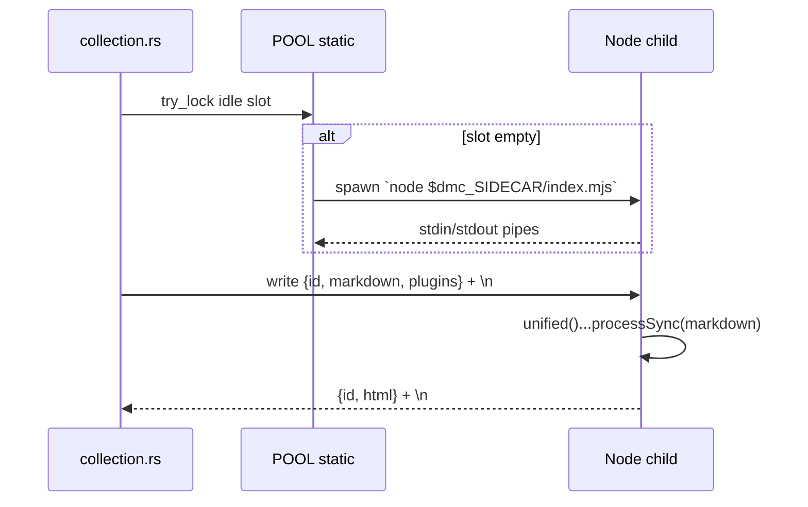

# Sidecar

Long-lived Node child process pool. Runs unified-style remark + rehype
plugins the dmc engine cannot run natively.

## Lifecycle



## Pool

```rust
static POOL: OnceLock<Vec<Mutex<Option<Sidecar>>>> = OnceLock::new();
static REQ_ID: AtomicU64 = AtomicU64::new(0);
static NEXT_SLOT: AtomicUsize = AtomicUsize::new(0);

fn pool_size() -> usize {
    std::env::var("DMC_SIDECAR_POOL_SIZE")
        .ok()
        .and_then(|s| s.parse().ok())
        .unwrap_or_else(|| {
            std::thread::available_parallelism()
                .map(|p| p.get().min(4))
                .unwrap_or(2)
        })
}
```

Default = `min(cores, 4)`. Override via env. Each slot holds an
`Option<Sidecar>`; spawned lazily on first use.

## `run_sidecar`

```rust
pub fn run_sidecar(markdown: &str, cfg: &EngineConfig) -> Option<String>;
```

Path: `dmc::engine::sidecar::run_sidecar`. Returns rendered HTML or
`None` on any failure (caller falls through to native HTML).

### Slot acquisition

```rust
let mut guard = None;
for _ in 0..n {
    let idx = NEXT_SLOT.fetch_add(1, Ordering::Relaxed) % n;
    if let Ok(g) = pool[idx].try_lock() {
        guard = Some(g);
        break;
    }
}
let mut guard = match guard {
    Some(g) => g,
    None => {
        let idx = NEXT_SLOT.fetch_add(1, Ordering::Relaxed) % n;
        pool[idx].lock().ok()?
    },
};
```

Round-robin try-lock first; block on the round-robin pick if every
slot is busy. Avoids head-of-line blocking under heavy parallel load.

## Plugin gate

Before serialising the request, plugins owned by native transformers are
stripped:

```rust
let remark_md = cfg.compile.effective_markdown_remark_plugins();
let remark_mdx = cfg.compile.effective_mdx_remark_plugins();
let rehype_md = cfg.compile.effective_markdown_rehype_plugins();
let rehype_mdx = cfg.compile.effective_mdx_rehype_plugins();
```

Stripped names (when their feature is on): `remark-gfm`, `remark-math`,
`remark-emoji`, `rehype-pretty-code`, `shiki`, `rehype-katex`,
`rehype-mathjax`, `rehype-slug`, `rehype-autolink-headings`. See
`dmc-docs/dmc-core/api.md` and the gate logic in `compile.rs`.

If after stripping every list is empty, `has_js_plugins()` returns
false and the sidecar is never spawned.

## Wire format

NDJSON over stdin/stdout. One line in, one line out:

```json
{"id":42,"markdown":"# hello\n","remarkPlugins":[],"rehypePlugins":[]}
```

Reply:

```json
{"id":42,"html":"<h1>hello</h1>"}
```

See `dmc-docs/dmc-sidecar/protocol.md` for full schema.

## Failure modes

| failure | behaviour |
|---------|-----------|
| `node` not on PATH | `Sidecar::new` returns `None`; `run_sidecar` returns `None`; native HTML is used |
| sidecar process dies mid-stream | next request in that slot re-spawns |
| invalid JSON reply | `run_sidecar` returns `None` |

Caller (`Collection::process`) falls through silently. The sidecar is
strictly an enhancement; absence does not block builds.
