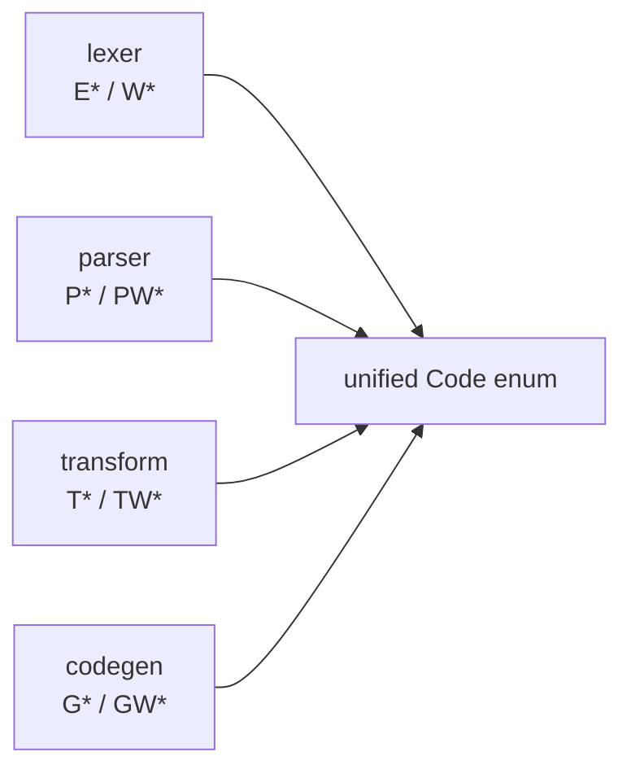

# dmc-diagnostic

Shared diagnostic codes for every dmc layer. One enum, gated by Cargo
features so each layer pulls in only its own variants.

## Code prefixes



| prefix | layer | severity |
|--------|-------|----------|
| `E001` | lexer | error |
| `W001` | lexer | warning |
| `P001` | parser | error |
| `PW001` | parser | warning |
| `T001` | transform | error |
| `TW001` | transform | warning |
| `G001` | codegen | error |
| `GW001` | codegen | warning |

## Why one enum

Diagnostics flow through `duck_diagnostic::DiagnosticEngine<Code>`. A
single `Code` type means every layer can emit through the same engine
without forking. Third-party transformers can ship via `Code::Custom`.

## Feature gating

```toml
dmc-diagnostic = { workspace = true, features = ["lexer", "parser", "transform", "codegen"] }
```

Each consumer crate enables only the features for layers it needs.
Avoids dragging unused variant names through every dependent.

## Files

- [`api.md`](api.md) - exported types
- [`codes.md`](codes.md) - exhaustive variant table
- [`metadata.md`](metadata.md) - `SourceMeta` + `Origin`
- [`examples.md`](examples.md) - emit + read diagnostics
