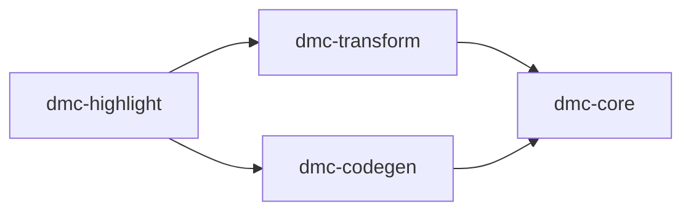

# dmc-highlight

Bundled `syntect` syntax + theme registry. Single source of truth for
code-block highlighting across the workspace. Loaded once per process,
shared across every render.

## Why a separate crate

`dmc-codegen` and `dmc-transform::pretty-code` both need the
highlighter. `dmc-codegen` itself is consumed by `dmc-transform` via a
feature flag. Cargo forbids package-level cycles, so the highlighter
lives in a leaf crate that both depend on.

## Assets

- `assets/themes-bat/*.tmTheme` - bat-style theme bundle (Catppuccin
  variants, Nord, OneHalf, Solarized, Tokyo Night, etc).
- `assets/grammars-sublime/*.sublime-syntax` - VS Code syntax bundle
  exported from shiki (rust, ts, tsx, json, bash, ...).

`build.rs` scans both dirs at compile time and emits `Theme` and
`Grammar` enums plus `THEMES` / `GRAMMARS` slices into `OUT_DIR`. So
the bundle list is statically known to consumers.

## Key types

| Symbol | Path | Use |
|--------|------|-----|
| `SyntaxBundle` | `dmc_highlight::SyntaxBundle` | Lazy-loaded process-global bundle |
| `highlight_code` | `dmc_highlight::highlight_code` | Single-theme, free function |
| `highlight_code_multi` | `dmc_highlight::highlight_code_multi` | Multi-theme, single tokenize |
| `MultiToken` | `dmc_highlight::MultiToken` | One token, N styles |
| `Theme` | `dmc_highlight::Theme` | Generated enum, one variant per `.tmTheme` |
| `Grammar` | `dmc_highlight::Grammar` | Generated enum, one variant per `.sublime-syntax` |
| `HlStyle` / `Color` | re-exports of `syntect::highlighting::{Style, Color}` | Token style + RGBA |

## Files in this folder

- [`api.md`](api.md) - public surface
- [`themes.md`](themes.md) - bundled themes + name resolution
- [`grammars.md`](grammars.md) - bundled grammars + lookup fallbacks
- [`multi-theme.md`](multi-theme.md) - single-tokenize multi-color algorithm
- [`examples.md`](examples.md) - usage snippets
