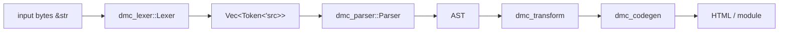

# dmc-lexer

Streaming lexer for MDX. Turns a `&str` source buffer into a `Vec<dmc_lexer::token::Token<'src>>`.

Zero-copy: every token's `raw` field borrows from the input. No allocation per token; the only `Vec` is the output stream.

## Pipeline position



Diagnostics flow sideways through `&mut DiagnosticEngine<dmc_diagnostic::Code>`; the lexer never returns errors. `scan_tokens` always returns `Ok(())` and reports problems through the engine.

## Key types at a glance

```rust
dmc_lexer::Lexer<'eng, 'src>          // the scanner
dmc_lexer::token::Token<'src>         // one emitted token (kind + span + raw slice)
dmc_lexer::token::TokenKind           // tagged enum of every token variety
```

Construct with `dmc_lexer::Lexer::new(source, meta, &mut engine)`, then call `scan_tokens()`. Tokens land in `lexer.tokens`.

## Quick example

```rust
use std::sync::Arc;
use dmc_lexer::Lexer;
use dmc_diagnostic::metadata::{Origin, SourceMeta};
use duck_diagnostic::DiagnosticEngine;

let source = "# hello";
let meta = Arc::new(SourceMeta {
    path: Arc::from("doc.mdx"),
    version: 0,
    origin: Origin::Stdin,
});
let mut engine = DiagnosticEngine::new();
let mut lexer = Lexer::new(source, meta, &mut engine);
lexer.scan_tokens().unwrap();
for tok in &lexer.tokens {
    println!("{}", tok);
}
```

See `examples.md` for end-to-end traces, `tokens.md` for the full `TokenKind` reference, and `api.md` for the public surface.
