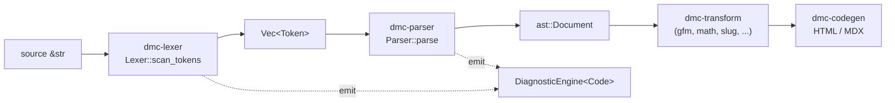
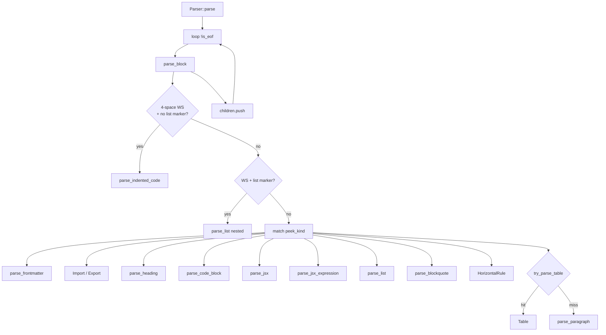

# dmc-parser

Token stream to AST. Sits between `dmc-lexer` (chars to tokens) and
`dmc-transform` / `dmc-codegen` (AST mutate / emit).

## Job

- Take `Vec<Token<'src>>` from `dmc-lexer::Lexer`.
- Build a `Document` tree of `Node` variants (block + inline + JSX).
- Push diagnostics into the shared `DiagnosticEngine<Code>`.
- Cursor parser. No backtracking except for table/setext/link probes.

## Pipeline place

## Parse flow

## Key types at a glance

- `dmc_parser::Parser<'eng, 'tokens>` (parser.rs) - cursor + diag engine.
- `dmc_parser::parse(source)` (parser.rs) - one-shot lex+parse, drops diags.
- `dmc_parser::parse_inline_str(s)` (parser.rs) - inline-only entry; used
  by table cells.
- `dmc_parser::ast::Document` (ast/node.rs) - root node.
- `dmc_parser::ast::Node` (ast/node.rs) - 28-variant enum covering blocks,
  inlines, JSX, breaks.
- `dmc_parser::ast::JsxAttr`, `JsxAttrValue` (ast/jsx.rs) - JSX attrs.

## Files

- `src/lib.rs` - re-exports `Parser`, `parse`, `parse_inline_str`.
- `src/parser.rs` - `Parser` struct, top-level `parse`, helpers.
- `src/block.rs` - block dispatch + frontmatter / heading / list /
  blockquote / code block / paragraph / setext / indented code.
- `src/inline.rs` - emphasis, code, link, image, autolink, escape.
- `src/jsx.rs` - tags, attrs, expressions, comments.
- `src/table.rs` - GFM table speculative parse.
- `src/ast/node.rs` - `Node` enum + every block/inline struct.
- `src/ast/jsx.rs` - `JsxAttr`, `JsxAttrValue`.
- `grammar.txt` - EBNF-ish reference grammar.

## See also

- [api.md](api.md) - public surface.
- [ast.md](ast.md) - every Node variant and field.
- [block-parser.md](block-parser.md) - block-level details.
- [inline-parser.md](inline-parser.md) - inline-level details.
- [examples.md](examples.md) - worked parses.
