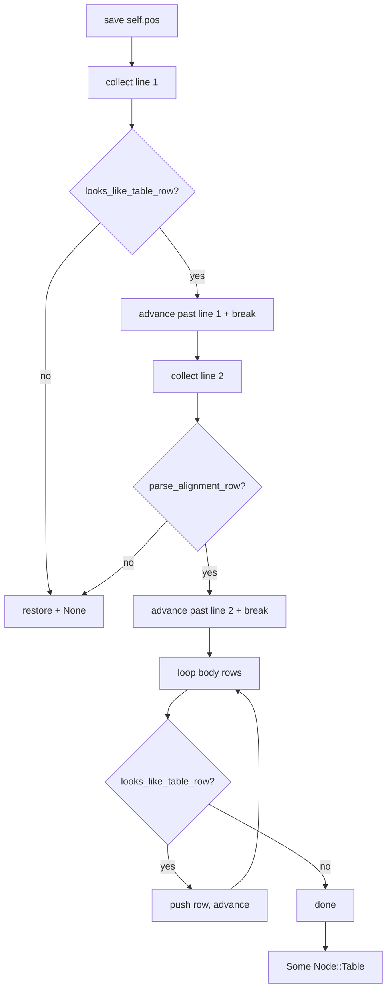

# Table parser

GFM table parsing lives in `dmc-parser/src/table.rs`. Speculative:
the parser tries the table path first, rolls back on mismatch.

## Entry

```rust
pub(crate) fn try_parse_table(&mut self) -> Option<Node>;
```

Returns `Some(Node::Table)` on success, `None` on any mismatch with
the cursor restored.

## Algorithm



## `collect_line_text`

```rust
fn collect_line_text(&self) -> Option<(String, usize)>;
```

Concatenates `t.raw` of every token from the cursor until the next
break or block-level boundary (SoftBreak, HardBreak, Eof, Heading,
FrontmatterStart, Import, Export). Returns `(text, count)` where
`count` is the number of tokens consumed.

## Row detection

```rust
fn looks_like_table_row(s: &str) -> bool {
    let t = s.trim();
    t.starts_with('|') && t.ends_with('|') && t.matches('|').count() >= 2
}
```

Trims leading and trailing whitespace; both `|` boundaries required.

## Alignment row

```rust
fn parse_alignment_row(s: &str) -> Option<Vec<TableAlign>>;
```

Parses `|:---|---:|:---:|`. Each segment must be one of:

| segment | -> |
|---------|----|
| `---`   | `TableAlign::None` |
| `:---`  | `TableAlign::Left` |
| `---:`  | `TableAlign::Right` |
| `:---:` | `TableAlign::Center` |

Empty segment or non-`-` middle char -> `None`, parse fails.

## Cell split

```rust
fn split_cells(s: &str) -> Vec<String>;
```

Strips outer `|`, splits on `|`. No trim on the cell strings
(`make_row` trims when materialising).

## Row build

```rust
fn make_row(cells: &[String], span: &Span) -> TableRow;
```

For each cell:

1. `trim()` the raw string
2. If empty -> empty `Vec<Node>`
3. Else -> `parse_inline_str(trimmed)` (full inline parser run on the
   cell)
4. Wrap in `TableCell { children, span }`

So cells support inline marks (bold, italic, code, links, etc):

```md
| **bold** | _italic_ | `code` |
```

## Output AST

```rust
Node::Table(Table {
    align: Vec<TableAlign>,    // one entry per column
    children: Vec<TableRow>,   // header + body rows
    span,
})
```

Header is `children[0]`; body rows follow.

## HTML emit

`HtmlEmitter` walks the table:

```html
<table>
  <thead>
    <tr><th align="...">cell</th>...</tr>
  </thead>
  <tbody>
    <tr><td align="...">cell</td>...</tr>
    ...
  </tbody>
</table>
```

`align` attribute set per cell from `Table::align[i]` when not
`None`.

## Why speculative

`|` can appear in plain text. Without speculative parse + rollback,
every paragraph would have to scan forward for table shape. The
speculative path commits only after both header + alignment rows
match.

## Limitations

- No multi-line cells (CommonMark / GFM does not support them).
- No row span / col span.
- No table caption.
- Cell-content inline-only (no block-level inside cells).
