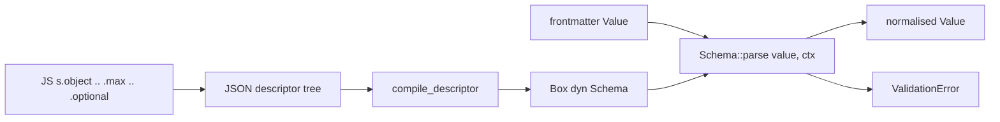

# dmc-schema

Frontmatter validation. Takes a `serde_json::Value` (parsed YAML/TOML/JSON frontmatter), runs it through a `Box<dyn Schema>`, returns a normalised `Value` or a `ValidationError`.

Two ways to build a schema:

1. Rust-side, via the `s::*` builder (`s::object`, `s::string().min(2)`, ...). Used by tests and any pure-Rust caller.
2. JS-side, via the `@gentleduck/md` `s.object(...)` builder. The JS builder serialises every node to a JSON descriptor (`{kind: "string", min: 2, ...}`). The Rust adapter calls `compile_descriptor(&value)` to materialise a `Box<dyn Schema>`. This is the path taken when the engine runs from Node.

`transform` and `refine` predicates are JS closures and cannot cross FFI; the Rust compiler skips them and validates the inner schema only. Hooks re-run on the JS side after Rust validation.

## Pipeline position

## What `parse` does

- Type-checks the value against the descriptor.
- Applies modifiers: `optional` and `nullable` short-circuit on `null`, `default` substitutes a fallback when the value is null, `transform` rewrites the parsed value, `refine` / `super_refine` add user predicates.
- Pulls derived fields from `Ctx`: `markdown` returns `ctx.html`, `mdx` returns `ctx.mdx_body`, `toc` returns `ctx.toc`, `metadata` computes `wordCount` + `readingTime` from `ctx.plain_text`, `excerpt` truncates `ctx.plain_text`, `path` derives the route from `ctx.file_path` minus `ctx.root`, `raw` returns `ctx.body`.
- Resolves asset references: `file` and `image` read bytes off disk, hash with blake3, copy into `Ctx::assets.assets_dir`, and return the rewritten URL. `image` also produces an 8px WebP blur-data-url and original dimensions.
- Enforces uniqueness via `Ctx::unique_cache`: `slug` (with kebab-case + reserved-list checks) and `unique` both intern keys as `bucket::value`.

## Files in this folder

- `README.md` - this file.
- `api.md` - every public type / fn with canonical paths.
- `descriptors.md` - the JSON descriptor shape consumed by `compile_descriptor`.
- `examples.md` - validate frontmatter, transform during validation, error-on-failure.
