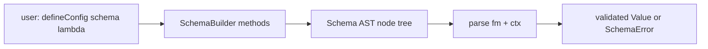

# dmc-schema internals

How the schema descriptor is compiled, evaluated, and reported on.

## Crate goal

Define collection record shapes. Validate frontmatter (and selected
body fields). Surface friendly errors. Avoid Zod-on-the-server
weight; ship a small typed AST instead.

## Pipeline



Two phases:

1. **Build**: user's `(s) => s.object({...})` lambda runs once per
   collection at config load. Output: a `Schema` enum tree.
2. **Parse**: per file, called from `Collection::process`. Input:
   raw frontmatter + body context. Output: typed `serde_json::Value`
   or `SchemaError`.

## Schema AST

```rust
pub enum Schema {
    String(StringRules),
    Number(NumberRules),
    Boolean,
    Date(DateKind),
    Array(Box<Schema>, ArrayRules),
    Object(BTreeMap<String, FieldSpec>),
    Union(Vec<Schema>),
    Optional(Box<Schema>),
    Default(Box<Schema>, Value),
    Computed(ComputedKind),
    Custom(Arc<dyn Fn(&Value, &Ctx) -> Result<Value, SchemaError> + Send + Sync>),
}
```

Each variant carries its constraints inline. No interpreter
indirection beyond a single recursive `parse` call.

## Builder API surface

```rust
pub struct SchemaBuilder;

impl SchemaBuilder {
    pub fn string(&self) -> StringSchema;
    pub fn number(&self) -> NumberSchema;
    pub fn boolean(&self) -> Schema;
    pub fn isodate(&self) -> Schema;
    pub fn array<T: Into<Schema>>(&self, inner: T) -> ArraySchema;
    pub fn object(&self, fields: Object) -> Schema;
    pub fn union(&self, variants: Vec<Schema>) -> Schema;
    pub fn path(&self) -> Schema;          // computed: relative file path
    pub fn slug(&self, src: &str) -> Schema; // computed: slugify another field
    pub fn excerpt(&self, len: usize) -> Schema; // computed: body excerpt
    pub fn s(&self) -> &Self;              // chainable
}
```

The N-API wrapper exposes the same surface to TS via
`SchemaBuilder` proxy. Each call records a `Schema` node;
`.optional()` / `.default(...)` wrap.

## Computed fields

`path`, `slug`, `excerpt` resolve from a `Ctx` passed to `parse`:

```rust
pub struct Ctx<'a> {
    pub source_path: &'a Path,
    pub root: &'a Path,
    pub body_text: &'a str,
    pub frontmatter: &'a Value,
}
```

Computed nodes have no input frontmatter requirement; the rule
generates the value from `Ctx`.

```rust
Schema::Computed(ComputedKind::Path) =>
    Value::String(rel_path(ctx.source_path, ctx.root))

Schema::Computed(ComputedKind::Slug { src }) =>
    Value::String(slugify(get_field(ctx.frontmatter, src)?))

Schema::Computed(ComputedKind::Excerpt { len }) =>
    Value::String(first_n_chars(ctx.body_text, len))
```

## Parse algorithm

```rust
fn parse(schema: &Schema, value: &Value, ctx: &Ctx) -> Result<Value, SchemaError> {
    match schema {
        Schema::String(rules) => parse_string(value, rules),
        Schema::Number(rules) => parse_number(value, rules),
        Schema::Object(fields) => {
            let map = value.as_object().ok_or(...)?;
            let mut out = serde_json::Map::new();
            for (k, spec) in fields {
                let raw = map.get(k).cloned().unwrap_or(Value::Null);
                let parsed = parse(&spec.schema, &raw, ctx)
                    .map_err(|e| e.with_path(k))?;
                out.insert(k.clone(), parsed);
            }
            Ok(Value::Object(out))
        }
        Schema::Optional(inner) => {
            if value.is_null() { Ok(Value::Null) }
            else { parse(inner, value, ctx) }
        }
        Schema::Default(inner, default) => {
            if value.is_null() { Ok(default.clone()) }
            else { parse(inner, value, ctx) }
        }
        ...
    }
}
```

Recursive. Stack depth = schema nesting depth (typically < 10).

## Error path

`SchemaError` accumulates a JSON pointer-style path:

```rust
pub struct SchemaError {
    pub path: Vec<String>,    // ["object", "fields", "title"]
    pub message: String,
    pub expected: String,     // "string"
    pub actual: String,       // "number"
}

impl SchemaError {
    pub fn with_path(self, segment: impl Into<String>) -> Self {
        let mut path = self.path;
        path.insert(0, segment.into());
        Self { path, ..self }
    }
}
```

Render: `frontmatter.tags[2]: expected string, got number`.

## String rules

```rust
pub struct StringRules {
    pub min: Option<usize>,
    pub max: Option<usize>,
    pub pattern: Option<Regex>,    // serialised + recompiled
    pub trim: bool,
    pub lowercase: bool,
}
```

Builder methods chain:
`s.string().min(1).max(100).regex(/^[a-z-]+$/).trim()`.

## Number rules

```rust
pub struct NumberRules {
    pub min: Option<f64>,
    pub max: Option<f64>,
    pub int: bool,
    pub positive: bool,
}
```

Coerces JSON `Number` -> f64; rejects strings / nulls (use
`.optional()` for nullable).

## Date

`Schema::Date(DateKind::Iso)` requires `YYYY-MM-DD` or
`YYYY-MM-DDTHH:MM:SSZ`. Parses to `chrono::DateTime<Utc>` and
re-emits as ISO 8601 string. The output `Value::String` is canonical
format, not the user's spelling.

## Array rules

```rust
pub struct ArrayRules {
    pub min: Option<usize>,
    pub max: Option<usize>,
    pub unique: bool,
}
```

Inner `Schema` validates each element. `unique` checks structural
equality post-parse.

## Optional vs Default

`Schema::Optional(T)` -> field can be missing or null; output
`Value::Null` if missing.

`Schema::Default(T, default)` -> field can be missing; output is
`default` if missing, else `parse(T)`.

Mutually exclusive at builder level: `.optional()` and `.default(x)`
on the same field is a config error caught at build time.

## Custom validators

Escape hatch:

```ts
const schema = s.object({
  status: s.custom((v) => {
    if (v === "draft" || v === "published") return v;
    throw new Error("status must be draft or published");
  }),
});
```

In Rust:

```rust
Schema::Custom(Arc::new(|value, _ctx| {
    match value.as_str() {
        Some("draft") | Some("published") => Ok(value.clone()),
        _ => Err(SchemaError::custom("status must be draft or published")),
    }
}))
```

## Serialisation

Schemas serialise to JSON for the TS-side `index.d.ts` generator.
Rules become tagged unions (`{ kind: "string", min: 1 }`). Custom
fns can't serialise (they're trait objects); serialise as
`{ kind: "custom" }` and the TS generator emits `unknown`.

## TS type generation

`dmc-napi` reads the serialised schema for each collection and
generates a `.d.ts`:

```ts
export interface Post {
  title: string;
  date: string;
  slug: string;
}
export const posts: Post[];
```

Per-collection interface; arrays exported in plural form
(`pluralize(name)` lowercased).

## Performance

Schema parsing is < 50 microseconds per file in typical use. Not
on the hot path; well below the lex + parse + emit cost.

## Testing

`dmc-schema/tests/` covers each rule independently. Snapshot tests
in `dmc-core` cover end-to-end (schema -> validated record -> JSON).
