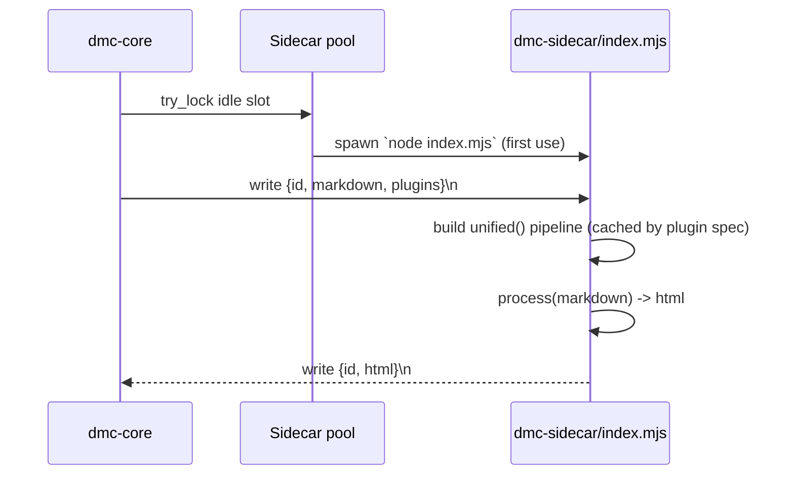

# dmc-sidecar

Node helper that runs unified-style remark + rehype plugins the dmc
engine cannot run natively (or that the user explicitly listed in
their `markdown.remarkPlugins` / `markdown.rehypePlugins`).

## Why it exists

Most popular remark/rehype plugins ship as JS only. Porting all of
them to Rust is impractical. Instead, dmc-sidecar runs them in a
long-lived Node child process pooled by `dmc-core::engine::sidecar`.

## Communication

NDJSON over stdin/stdout. One line in, one line out. No batching yet
(open lever).

## Plugin gate

Plugins owned by native dmc transformers are stripped before dispatch.
After stripping, if both lists are empty, the sidecar is never
spawned. Stripped names:

- `remark-gfm`
- `remark-math`
- `remark-emoji`
- `rehype-pretty-code`
- `shiki`
- `rehype-katex`
- `rehype-mathjax`
- `rehype-slug`
- `rehype-autolink-headings`

So a config that lists only those goes 100% native.

## Files

- [`protocol.md`](protocol.md) - request / response schema
- [`api.md`](api.md) - exports from `index.mjs`
- [`examples.md`](examples.md) - manual spawn + send
