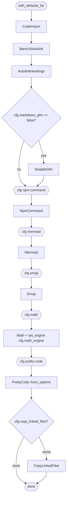

# dmc-transform

Post-parse AST passes that mutate `dmc_parser::ast::Document` in place.
Each pass absorbs work the JS sidecar (remark/rehype) would otherwise do
so the rust side can reach the codegen step without a JS round-trip.

## Place in pipeline

```
source -> dmc-parser -> dmc-transform -> dmc-codegen -> HTML/MDX
                       ^^^^^^^^^^^^^
```

Some passes run *before* the parser too: `Math::preprocess_source`
rewrites raw `$...$` to `<MathMl/>` JSX before the lexer sees it,
because `_` and `^` inside math would otherwise tokenise as emphasis.

## Bundled transformers

| Name             | Feature flag    | One-liner                                                  |
| ---------------- | --------------- | ---------------------------------------------------------- |
| `code-import`    | always on       | Resolve `file=path[{ranges}]` in fenced blocks             |
| `bare-url`       | always on       | Wrap bare `http(s)://...` in inline `Link` nodes           |
| `autolink-headings` | always on    | Wrap heading children in self-anchor `Link`                |
| `disable-gfm`    | always on (gated by `cfg.markdown_gfm`) | Flatten tables / strike / task-items |
| `npm-command`    | `npm-command`   | `npm install ...` -> `<PackageManagerTabs>`                |
| `mermaid`        | `mermaid`       | `mermaid` blocks -> `<MermaidSvg>` via `mmdc` CLI          |
| `emoji`          | `emoji`         | `:shortcode:` -> unicode emoji                             |
| `math`           | `math`          | `$...$` / `$$...$$` -> `<MathMl/>` via KaTeX or pulldown   |
| `pretty-code`    | `pretty-code`   | Fenced blocks -> `<figure><pre><code>` with syntect colors |
| `copy-linked-files` | `assets`     | Hash-rename + copy referenced images / relative links      |
| `component-preview` | always on    | `<ComponentPreview name=...>` -> code block from registry  |
| `component-source`  | always on    | `<ComponentSource path=...>` -> code block from disk       |

## Feature flags

| Flag           | Default | Adds                                                |
| -------------- | ------- | --------------------------------------------------- |
| `mermaid`      | yes     | `Mermaid` (mmdc CLI invocation)                     |
| `assets`       | yes     | `CopyLinkedFiles` + `blake3` dep                    |
| `npm-command`  | yes     | `NpmCommand`                                        |
| `math`         | yes     | `Math` + `katex` + `pulldown-latex` deps            |
| `emoji`        | yes     | `Emoji` + `emojis` dep                              |
| `pretty-code`  | off     | `PrettyCode` + `dmc-highlight` (syntect bundle) dep |

`pretty-code` is opt-in because the syntect bundle is large.

## `with_defaults_for(cfg)` chain



Feature gating lives in one function (`Pipeline::with_defaults_for`).
Callers do not sprinkle `cfg!(feature = ...)` of their own.

## Files

- [`api.md`](api.md): every public type / function.
- [`pipeline.md`](pipeline.md): `Pipeline` + builder.
- [`visitor.md`](visitor.md): `Visitor` trait + `walk_root` driver.
- [`writing-a-transformer.md`](writing-a-transformer.md): how to add one.
- [`transformers/`](transformers/): one file per built-in.
