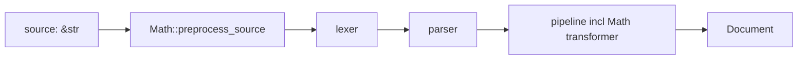

# Math

Renders LaTeX in `$...$` (inline) and `$$...$$` (block) to HTML.
Replaces the JS chain `remark-math` + `rehype-katex`.

## Feature flag

`math` (default on). Pulls `katex` (quick-js) and `pulldown-latex`.

## Two stages



### Source preprocess

`Math::preprocess_source(source)` runs BEFORE the lexer. Rewrites
`$...$` and `$$...$$` to `<MathMl mathml="..."/>` JSX.

Why: dmc parser interprets `_`/`^` inside math as Markdown emphasis
markers, shredding multi-character LaTeX operators
(`\sum_{i=1}^{n}`). Substituting at source level keeps math syntax
intact.

Skips fenced code blocks, inline code spans, and existing JSX.

```rust
pub fn preprocess_source(source: &str) -> String;
```

Path: `dmc_transform::Math::preprocess_source`. Called by
`dmc-core::Compiler::compile_with_pipeline` before the lexer.

### Transform pass

`Math` transformer also runs on the parsed AST. Catches any `$...$`
that survived parsing intact (programmatically constructed Documents,
edge cases). Most real source goes through the preprocess path.

## Engine

```rust
pub enum MathEngine {
    Katex,    // KaTeX HTML, slow but rehype-katex parity
    Mathml,   // pulldown-latex MathML, fast, plainer visual
}
```

Path: `dmc_transform::MathEngine`. Default `Katex`.

```ts
mathEngine: "mathml"  // opt out of KaTeX
```

| engine | per-expression | output |
|--------|---------------|--------|
| `Katex` | 1-5 ms | full KaTeX HTML + accessibility MathML |
| `Mathml` | ~10 us | bare `<math>` element |

KaTeX uses `quick-js` (embedded JS engine). Output is byte-equivalent
to `rehype-katex`.

## Cache

In-memory `HashMap<(latex, display, engine), html>`. Persisted to
`<output_dir>/.cache/math.json` between builds. Repeated math
expressions hit memory in microseconds.

```rust
pub fn load_cache(path: &Path);
pub fn save_cache(path: &Path);
```

Called by `dmc::Engine::run` at start / end.

## API

```rust
pub struct Math;

impl Math {
    pub fn preprocess_source(source: &str) -> String;
    pub fn render(latex: &str, display: bool) -> String;
    pub fn render_node(latex: &str, display: bool, span: &Span) -> Node;
    pub fn set_engine(engine: MathEngine);
    pub fn load_cache(path: &Path);
    pub fn save_cache(path: &Path);
}
```

`render` returns HTML string; `render_node` returns a JSX self-closing
node (`<MathMl mathml="..."/>`).

## Codegen escape hatch

Rendered HTML lives in a JSX attribute on `<MathMl/>`. The JSX-attr
parsing requires `"` escaped to `&quot;` and `&` to `&amp;`. The
HTML emitter unescapes both before pasting verbatim.

```rust
"MathMl" => {
    if let Some(attr) = s.attrs.iter().find(|a| a.name == "mathml")
        && let JsxAttrValue::String(mathml) = &attr.value
    {
        let unescaped = mathml.replace("&quot;", "\"").replace("&amp;", "&");
        self.out.push_str(&unescaped);
    }
}
```

Mirrors the `MermaidSvg` paster pattern.

## Example

Input:

```mdx
Inline: $E = mc^2$

Block:

$$
\int_{-\infty}^{\infty} e^{-x^2}\,dx = \sqrt{\pi}
$$
```

After preprocess:

```mdx
Inline: <MathMl mathml="<span class=&quot;katex&quot;>...</span>"/>

Block:

<MathMl mathml="<span class=&quot;katex-display&quot;>...</span>"/>
```

After parse + emit (HTML):

```html
<p>Inline: <span class="katex">...</span></p>
<span class="katex-display">...</span>
```

## Plugin gate

When `math` feature is on, `remark-math`, `rehype-katex`, and
`rehype-mathjax` are stripped from the sidecar payload.

## Failure mode

`pulldown-latex` or `katex` rejecting input -> emit a fallback span:

```html
<span class="math-error">$\bad latex$</span>
```

Original LaTeX preserved; never silently drops.
