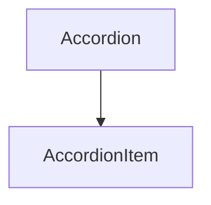

# `mermaid`

Pre-renders mermaid diagrams to inline SVG via the external `mmdc` CLI
(`@mermaid-js/mermaid-cli`). The browser never runs mermaid; the
consumer just picks an attr based on the active theme.

- **Source:** `dmc-transform/src/builtin/mermaid.rs`
- **Feature flag:** `mermaid`
- **Config struct:** [`MermaidOptions`](../src/config.rs)
- **TS slot:** `markdown.mermaid` / `mdx.mermaid`

## Inputs handled

```text

```

…and existing JSX:

```mdx
<MermaidDiagram chart={`graph TD ...`} />
```

## Output JSX

Default theme (`Multi({ light: "default", dark: "dark" })`):

```jsx
<MermaidDiagram
  chart="graph TD\n    A[Accordion] --> B[AccordionItem]"
  lightSvg="<svg…>"
  darkSvg="<svg…>"
/>
```

Single-theme (`theme: "dark"`) emits one `chartSvg` attr instead.
Multi-theme with arbitrary keys (e.g. `{ day, night, dim }`) emits one
`${key}Svg` attr per entry.

## Full configuration

```ts
import { defineConfig } from '@gentleduck/md/config'

export default defineConfig({
  markdown: {
    mermaid: {
      // 1) THEME — pick one form
      theme: 'dark',                                // single → <MermaidDiagram chart chartSvg />
      // theme: { light: 'default', dark: 'dark' }, // default; lightSvg + darkSvg
      // theme: { day: 'forest', night: 'neutral', dim: 'dark' }, // any keys → daySvg/nightSvg/dimSvg

      // 2) RAW MERMAID CONFIG — anything mermaid.initialize() accepts.
      //    Forwarded verbatim to mmdc --configFile after a shallow
      //    merge over dmc defaults (htmlLabels:false + flowchart spacing).
      config: {
        fontFamily: 'Geist, system-ui, sans-serif',
        securityLevel: 'loose',
        look: 'handDrawn',                  // 'classic' | 'neo' | 'handDrawn'
        layout: 'elk',                      // 'dagre' | 'elk'
        themeVariables: {
          primaryColor: '#1e1e2e',
          primaryTextColor: '#cdd6f4',
          primaryBorderColor: '#89b4fa',
          lineColor: '#a6adc8',
          fontSize: '14px',
        },
        flowchart:    { curve: 'basis', diagramPadding: 12, nodeSpacing: 80, rankSpacing: 80 },
        sequence:     { actorMargin: 50, mirrorActors: false },
        gantt:        { barHeight: 20, fontSize: 12 },
        er:           { fontSize: 14 },
        gitGraph:     { showCommitLabel: true },
        pie:          { textPosition: 0.75 },
        class:        { defaultRenderer: 'dagre-wrapper' },
        state:        { defaultRenderer: 'dagre-wrapper' },
      },

      // 3) RENDER FLAGS
      backgroundColor: '#0b0b14',           // mmdc --backgroundColor; default 'transparent'
      htmlLabels: false,                    // default false; true = HTML-in-foreignObject node labels
      responsiveSvg: true,                  // default true; rewrites root width to 100%
      centerLabels: true,                   // default true; injects text-anchor=middle when htmlLabels:false

      // 4) CACHE + PUPPETEER
      outputDir: '.dmc-cache/mermaid',          // disk SVG cache, hash-keyed
      puppeteerConfigFile: './puppeteer.json',  // mmdc --puppeteerConfigFile
    },
  },
})
```

## Knob reference

| Knob | Default | Effect |
|---|---|---|
| `theme` | `{ light: "default", dark: "dark" }` | Single string OR `{ mode: theme }` map. Drives JSX attr names (`chartSvg` vs `${mode}Svg`). |
| `config` | `{}` | Free-form `mermaid.initialize` config. Shallow-merged on top of dmc defaults. |
| `backgroundColor` | `"transparent"` | `mmdc --backgroundColor`. |
| `htmlLabels` | `false` | When `true`, flowchart node labels render as HTML-in-`<foreignObject>`. Off by default — HTML labels mismeasure on the headless browser, clipping text. |
| `responsiveSvg` | `true` | Rewrites the first root-`<svg>` `width="…"` to `width="100%"` so the diagram scales to its container. |
| `centerLabels` | `true` | Injects `text-anchor="middle"` on label `<text>` / `<tspan>` so flowchart labels center inside their `<rect>` when `htmlLabels:false`. |
| `outputDir` | unset | Disk-backed SVG cache. Files hashed on `(theme, source)`. Persists across runs. |
| `puppeteerConfigFile` | unset | Forwarded to `mmdc --puppeteerConfigFile`. |

## Caching

In-memory cache (per `Mermaid` instance) dedupes identical
`(theme, source)` pairs across one compile run. Setting `outputDir`
adds a disk-backed cache that persists across runs.

## Failure modes

- `mmdc` not on `PATH` → whole transformer no-ops with
  `Code::MmdcUnavailable`; mermaid blocks left as fenced code.
- Per-block render error → `Code::MermaidRenderFailed` diagnostic;
  source block preserved.

## Sidecar opt-out

Add any of `"mermaid"`, `"rehype-mermaid"`, `"remark-mermaid"` to
`markdown.preferSidecar` to drop the native transformer.
