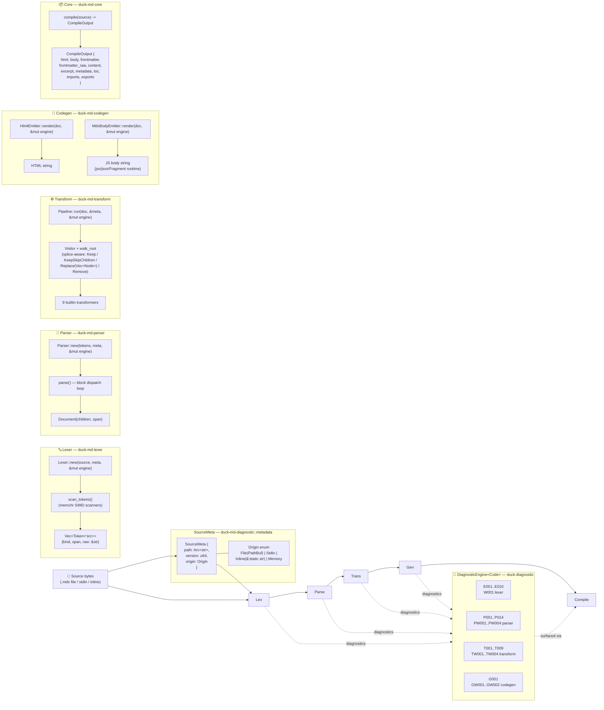
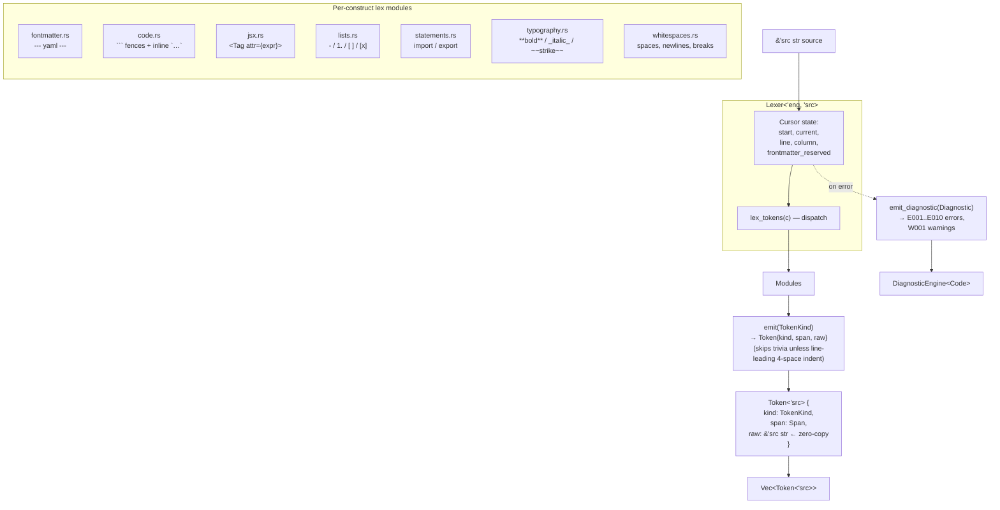
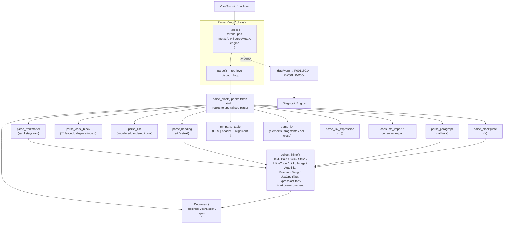
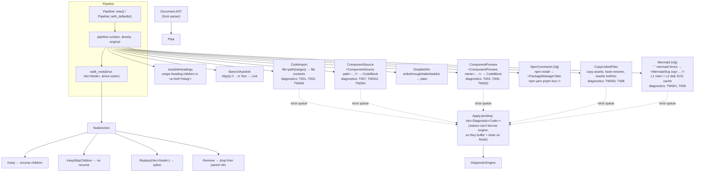
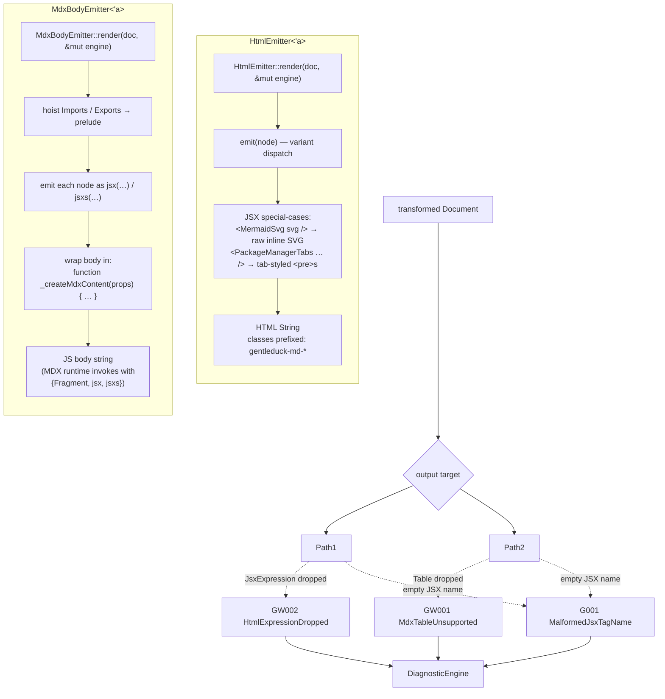
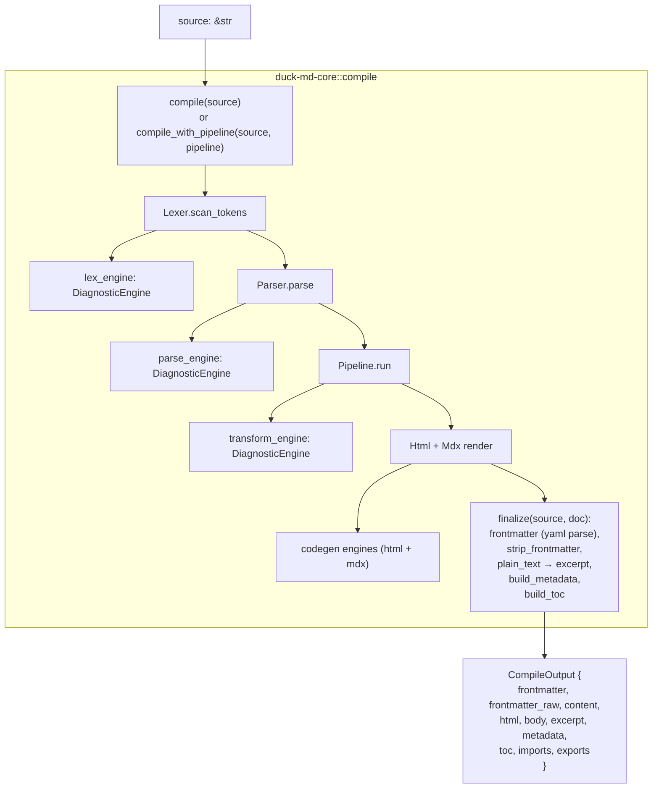
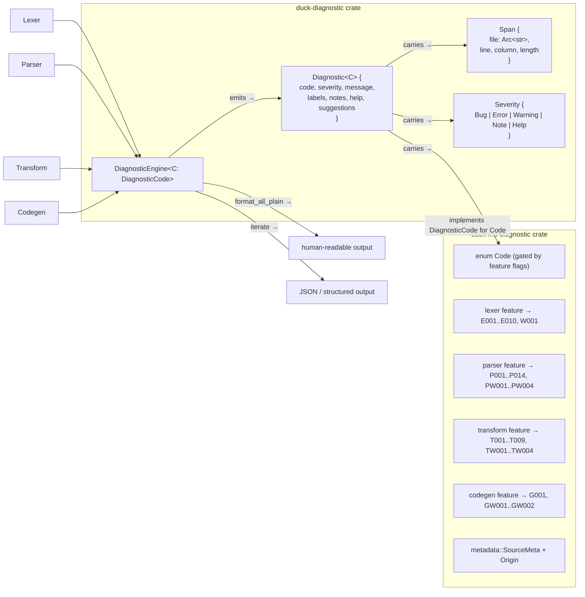
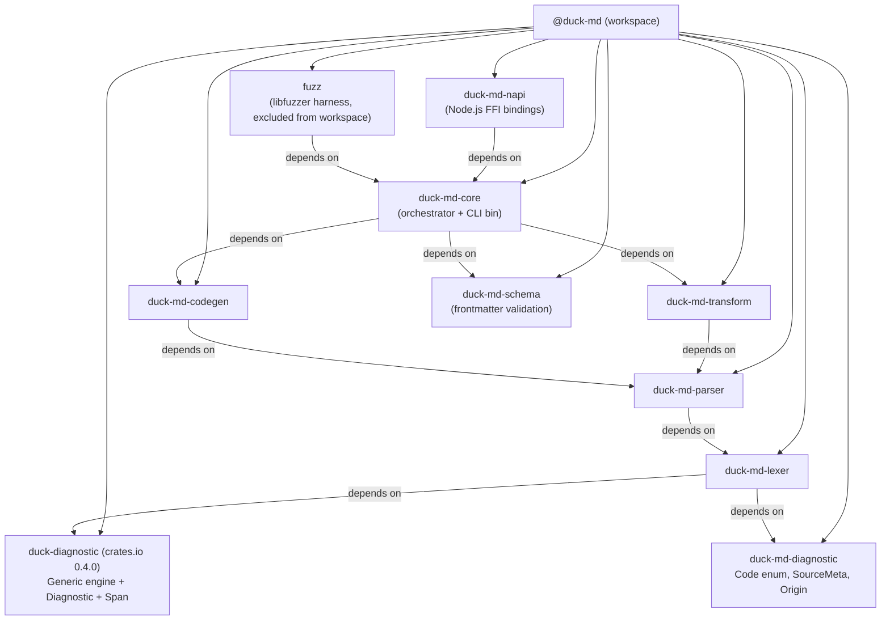

# duck-md compiler architecture

End-to-end view of every layer, the data that flows between them, and the diagnostic engine that watches the whole pipeline. Every box is a real Rust type or fn in the workspace.

## Top-level pipeline



## Lexer internals



**Key properties:**
- **Zero-copy**: `Token.raw` is `&'src str` — points into source buffer, no String allocation per token.
- **memchr SIMD**: `skip_until_byte`, `skip_while_byte` use vectorized scanners.
- **Recovery**: errors emit + advance, never abort.
- **State**: `frontmatter_reserved` flips on first `---…---` block so subsequent `---` lines become thematic breaks unambiguously.

## Parser internals



**Key properties:**
- **Pure structure**: AST is MDX-only — no derived fields. `Heading.id` is computed lazily via `Heading::slug()`. `Frontmatter.data` parsed at compile boundary, not by parser.
- **Real spans**: every node carries the originating token's span (not `default_span()`).
- **Force-advance**: a no-progress iteration advances anyway, so malformed tokens can't wedge the parser.
- **Recovery**: unterminated JSX synthesises a self-close + emits PW004.

## Transform pipeline internals



**Key properties:**
- **Walker honours all 4 NodeAction variants** — Replace splices `Vec&lt;Node&gt;`, Remove drops the index, Keep recurses, KeepSkipChildren stops descent.
- **`meta` threaded through** — transformers like CodeImport derive `base_dir` from `meta.origin` when File-backed; emit `BaseDirNotFound` warning for Stdin/Inline/Memory.
- **Pure helpers on the public struct** — `CodeImport::parse_file_meta`, `Mermaid::render_mmdc`, etc. State-touching code lives on `Apply`.

## Codegen internals



**Key properties:**
- **Engine plumbed like other layers** — `&mut DiagnosticEngine&lt;Code&gt;` parameter, no buffer-and-drain ceremony.
- **Class prefix** — every emitted CSS class starts with `gentleduck-md-` to avoid collision with user / framework styles.
- **Synthetic JSX** — transforms produce `&lt;MermaidSvg /&gt;` and `&lt;PackageManagerTabs /&gt;`; HTML emitter unwraps them server-side, MDX leaves them for the user's React component map.

## Compile-layer aggregation



## Cross-cutting: DiagnosticEngine



**Key properties:**
- **Single shared type across all layers** — `DiagnosticEngine&lt;Code&gt;` is the mailbox; layers borrow it mutably and emit.
- **Feature-gated codes** — `duck-md-lexer` only sees lexer codes, `duck-md-codegen` only sees codegen codes. Top-level `duck-md-core` enables every feature → full enum.
- **Per-token Span sharing via Arc&lt;str&gt;** — one allocation for the file path, every span clones the Arc cheaply.

## Workspace layout



## Per-runner CLI bins

| Crate | Bin | Default sample | Purpose |
|---|---|---|---|
| `duck-md-lexer` | `lexer` | `samples/errors/*.mdx` (loops) | dump tokens (table or JSON) |
| `duck-md-parser` | `parse` | `samples/index.mdx` | dump AST tree (or JSON) |
| `duck-md-transform` | `transform` | `samples/index.mdx` | before / after AST diff |
| `duck-md-codegen` | `codegen` | `samples/index.mdx` | AST + HTML / MDX body |

All four read from the shared `samples/` dir, accept `-` for stdin, support `--json`, `--quiet`, etc. Drop-in interchangeable.

## Source-meta + diagnostics flow (sequence)

```mermaid
sequenceDiagram
  participant Caller
  participant Core as duck-md-core
  participant Lexer
  participant Parser
  participant Transform
  participant Codegen
  participant Engine as DiagnosticEngine

  Caller->>Core: compile(source)
  Core->>Engine: new() (×4 — one per layer)
  Core->>Lexer: Lexer::new(src, meta, &mut engine)
  Lexer->>Engine: emit E*** / W*** during scan
  Lexer-->>Core: Vec<Token>
  Core->>Parser: Parser::new(tokens, meta, &mut engine)
  Parser->>Engine: emit P*** / PW*** during parse
  Parser-->>Core: Document
  Core->>Transform: pipeline.run(doc, &meta, &mut engine)
  Transform->>Engine: emit T*** / TW***
  Transform-->>Core: mutated Document
  Core->>Codegen: HtmlEmitter::render(&doc, &mut engine)
  Codegen->>Engine: emit G*** / GW***
  Codegen-->>Core: HTML string
  Core->>Codegen: MdxBodyEmitter::render(&doc, &mut engine)
  Codegen-->>Core: MDX body string
  Core-->>Caller: CompileOutput { html, body, frontmatter, … }
  Note over Engine: diagnostics from all layers<br/>currently dropped at boundary;<br/>plumbing them into CompileOutput<br/>is the next task
```

## Glossary of file paths

```
@duck-md/
├── samples/                       ← shared input fixtures
│   ├── index.mdx                  ← canonical full-feature sample
│   ├── headings.mdx
│   ├── bare-urls.mdx
│   ├── code-import.mdx
│   ├── snippets/                  ← imported by code-import.mdx
│   ├── errors/                    ← lexer error fixtures (E*** triggers)
│   └── architecture.mdx           ← THIS FILE
├── duck-md-lexer/
│   ├── src/{lib,token,utils}.rs
│   ├── src/lexers/{code,fontmatter,jsx,lists,statements,typography,whitespaces}.rs
│   └── lexer-samples/lexer.rs     ← bin
├── duck-md-parser/
│   ├── src/{lib,parser,block,inline,jsx,table}.rs
│   ├── src/ast/{node,jsx,mod}.rs
│   └── parse-samples/parse.rs     ← bin
├── duck-md-transform/
│   ├── src/{lib,pipeline,visit}.rs
│   ├── src/builtin/{autolink_headings,bare_url,code_import,
│   │                component_preview,component_source,
│   │                copy_linked_files,disable_gfm,mermaid,npm_command}.rs
│   └── transform-samples/transform.rs   ← bin
├── duck-md-codegen/
│   ├── src/{lib,escape,html,mdx}.rs
│   └── codegen-samples/codegen.rs       ← bin
├── duck-md-core/
│   └── src/{lib,compile,engine,main}.rs ← orchestrator + CLI
├── duck-md-diagnostic/
│   └── src/{lib,metadata}.rs            ← Code enum + SourceMeta
├── duck-md-schema/                ← frontmatter validation
├── duck-md-napi/                  ← Node.js FFI
└── fuzz/                          ← libfuzzer (excluded from workspace)
```

## Summary in one sentence

`bytes` → **Lexer** (zero-copy tokens) → **Parser** (pure-structure AST) → **Transform** (visitor pipeline mutating in place / splicing) → **Codegen** (HTML + JS body for MDX runtime) → **Core** wraps everything into `CompileOutput`, with a single `DiagnosticEngine` carrying typed `Code`s from every layer.
